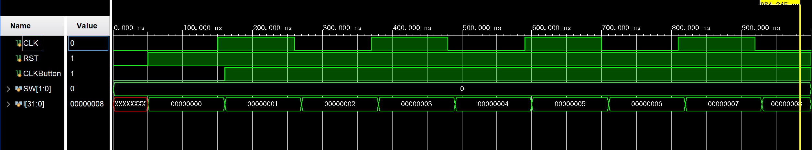

<div STYLE="page-break-after: always;"></div>

# 项目一：单周期CPU设计与实现 

------

## 实验目的

1. **理解CPU基本结构与功能**：熟悉CPU的基本组成部分，包括指令寄存器、程序计数器、算术逻辑单元（ALU）、寄存器组等，理解它们在CPU中的作用和相互关系。
2. **掌握指令周期**：通过实验，学习CPU如何按照指令周期执行指令，包括取指、译码、执行、访存和写回。
3. **实践硬件描述语言（HDL）**：使用硬件描述语言（Verilog）来实现CPU设计，加深对HDL编程和数字逻辑设计的理解和应用。
4. **调试和验证**：学习如何使用仿真工具对CPU设计进行调试和验证，确保其正确执行各种指令。

## 实验内容

设计一个单周期CPU，并从MIPS指令集中选取几条具有代表性的指令进行设计，该CPU能实现以下功能。

#### 指令与格式

##### **算数运算指令**

  1. <u>add  rd, rs, rt</u>
     
     | op     | rs   | rt   | rd   | shamt | func   |
     | ------ | ---- | ---- | ---- | ----- | ------ |
     | 000000 | 5位  | 5位  | 5位  | 00000 | 100000 |
     

  ​      功能：GPR[rd] ← GPR[rs] + GPR[rt]。  

  2. <u>sub  rd, rs, rt</u>
     
     | op     | rs   | rt   | rd   | shamt | func   |
     | ------ | ---- | ---- | ---- | ----- | ------ |
     | 000000 | 5位  | 5位  | 5位  | 00000 | 100010 |
     

​      功能：GPR[rd] ← GPR[rs] - GPR[rt]。

  3. <u>addiu  rt, rs, **immediate**</u> 
     
     | op     | rs   | rt   | immediate |
     | ------ | ---- | ---- | --------- |
     | 001001 | 5位  | 5位  | 16位      |
     

  ​      功能：GPR[rt] ← GPR[rs] + sign_extend(immediate)。
##### **逻辑运算指令**

  4. <u>andi  rt, rs, **immediate**</u>
     
     | op     | rs   | rt   | immediate |
     | ------ | ---- | ---- | --------- |
     | 001100 | 5位  | 5位  | 16位      |
     

  ​      功能：GPR[rt] ← GPR[rs] and zero_extend(immediate)。

  5. <u>and  rd, rs, rt</u>
     
     | op     | rs   | rt   | rd   | shamt | func   |
     | ------ | ---- | ---- | ---- | ----- | ------ |
     | 000000 | 5位  | 5位  | 5位  | 00000 | 100100 |
     

  ​      功能：GPR[rd] ← GPR[rs] and GPR[rt]。

  6. <u>ori  rt, rs, **immediate**</u>
     
     | op     | rs   | rt   | immediate |
     | ------ | ---- | ---- | --------- |
     | 001101 | 5位  | 5位  | 16位      |
     

  ​      功能：GPR[rt] ← GPR[rs] or zero_extend(immediate)。

  7. <u>or  rd, rs, rt</u>
     
     | op     | rs   | rt   | rd   | shamt | func   |
     | ------ | ---- | ---- | ---- | ----- | ------ |
     | 000000 | 5位  | 5位  | 5位  | 00000 | 100101 |
     

  ​      功能：GPR[rd] ← GPR[rs] or GPR[rt]。
##### **移位指令**

  8. <u>sll  rd, rt, sa</u>

     | op     | rs   | rt   | rd   | shamt | func   |
     | ------ | ---- | ---- | ---- | ----- | ------ |
     | 000000 | 00000  | 5位  | 5位  | 5位 | 000000 |
     

  ​      功能：GPR[rd] ← GPR[rt] << shamt。
##### **比较指令**

  9. <u>slti  rt, rs, **immediate**   *带符号数*</u>

     | op     | rs   | rt   | immediate |
     | ------ | ---- | ---- | --------- |
     | 001010 | 5位  | 5位  | 16位      |
     

  ​      功能：if GPR[rs] < sign_extend(immediate)  GPR[rt] =1 else  GPR[rt] = 0。
##### **存储器读/写指令**

  10. <u>sw  rt, **offset** (rs)  *写存储器*</u> 

      | op     | rs   | rt   | immediate |
      | ------ | ---- | ---- | --------- |
      | 101011 | 5位  | 5位  | 16位      |

​        功能：memory[GPR[base] + sign_extend(offset)] ← GPR[rt]。

  11. <u>lw  rt, **offset** (rs) *读存储器*</u>

      | op     | rs   | rt   | immediate |
      | ------ | ---- | ---- | --------- |
      | 100011 | 5位  | 5位  | 16位      |

​         功能：GPR[rt] ← memory[GPR[base] + sign_extend(offset)]。

##### **分支指令**

  12. <u>beq  rs, rt, **offset**</u>  

      | op     | rs   | rt   | immediate |
      | ------ | ---- | ---- | --------- |
      | 000100 | 5位  | 5位  | 16位      |

​        功能：if(GPR[rs] = GPR[rt])  pc ← pc + 4 + sign_extend(offset)<<2  else pc ← pc + 4

  13. <u>bne  rs, rt, **offset**</u>  

      | op     | rs   | rt   | offset |
      | ------ | ---- | ---- | ------ |
      | 000101 | 5位  | 5位  | 16位   |

​        功能：if(GPR[rs] != GPR[rt])  pc ← pc + 4 + sign_extend(offset) <<2  else pc ← pc + 4

  14. <u>bltz  rs, **offset**</u>  

      | op     | rs   | rt   | offset |
      | ------ | ---- | ---- | ------ |
      | 000110 | 5位  | 5位  | 16位   |

  ​      功能：if(GPR[rs] ≤ 0)  pc ← pc + 4 + sign_extend (offset) <<2  else pc ← pc + 4。
##### **跳转指令** 

  15. <u>j  **addr**</u>
      
      | op     | addr |
      | ------ | ---- |
      | 000010 | 26位 |
      

  ​      功能：PC ← {PC[31:28] , addr , 2’b0}，无条件跳转。
##### **停机指令**

  16. <u>**halt**</u>
       
      | op     | |
      | ------ | ---- |
      | 111111 | 00000000000000000000000000 |

  ​      功能：停机；不改变PC的值，PC保持不变。

#### 指令功能实现

依据以上指令要求设计出单周期CPU，实现元件间的连接，具体见**实验原理**部分

#### 仿真与测试单周期CPU

为了测试设计的单周期CPU能否正确运转，需要在CPU上运行一系列设计好的指令，指令码经过处理后以八位一行的形式放在 instructions.txt 中，CPU运行时被读进 instruction memories。

| **地址**       | **汇编程序**          | **指令代码** |           |           |                           |
| -------------- | --------------------- | ------------ | --------- | --------- | ------------------------- |
|                |                       | **op（6）**  | **rs(5)** | **rt(5)** | **rd(5)/immediate  (16)** |
| **0x00000000** | addiu   $1,$0,8       | **001001**   | **00000** | **00001** | **0000000000001000**      |
| **0x00000004** | ori   $2,$0,2         | 001101       | 00000     | 00010     | 0000000000000010          |
| **0x00000008** | add   $3,$2,$1        | 000000       | 00010     | 00001     | 0001100000100000          |
| **0x0000000C** | sub   $5,$3,$2        | 000000       | 00011     | 00010     | 0010100000100010          |
| **0x00000010** | and   $4,$5,$2        | 000000       | 00101     | 00010     | 0010000000100100          |
| **0x00000014** | or   $8,$4,$2         | 000000       | 00100     | 00010     | 0100000000100101          |
| **0x00000018** | sll   $8,$8,1         | 000000       | 00000     | 01000     | 0100000001000000          |
| **0x0000001C** | bne $8,$1,-2 (≠,转18) | 000101       | 01000     | 00001     | 1111111111111110          |
| **0x00000020** | slti   $6,$2,4        | 001010       | 00010     | 00110     | 0000000000000100          |
| **0x00000024** | slti   $7,$6,0        | 001010       | 00110     | 00111     | 0000000000000000          |
| **0x00000028** | addiu $7,$7,8         | 001001       | 00111     | 00111     | 0000000000001000          |
| **0x0000002C** | beq $7,$1,-2 (=,转28) | 000100       | 00111     | 00001     | 1111111111111110          |
| **0x00000030** | sw   $2,4($1)         | 101011       | 00001     | 00010     | 0000000000000100          |
| **0x00000034** | lw   $9,4($1)         | 100011       | 00001     | 01001     | 0000000000000100          |
| **0x00000038** | addiu   $10,$0,-2     | 001001       | 00000     | 01010     | 1111111111111110          |
| **0x0000003C** | addiu   $10,$10,1     | 001001       | 01010     | 01010     | 0000000000000001          |
| **0x00000040** | blez $10,-2(≤0,转3C)  | 000110       | 01010     | 00000     | 1111111111111110          |
| **0x00000044** | andi   $11,$2,2       | 001100       | 00010     | 01011     | 0000000000000010          |
| **0x00000048** | j   0x0000004C        | 000010       | 00000     | 00000     | 0000000001001100          |
| **0x0000004C** | or   $8,$4,$2         | 000000       | 00100     | 00010     | 0100000000100101          |
| **0x00000050** | halt                  | 111111       | 00000     | 00000     | 0000000000000000          |

#### Basys3 开发板烧录

- **显示数据说明：** 指令存储器中的指令地址范围：0 ~ 255；数据存储器中的数据地址范围：0 ~ 255。也就是只使用低8位。故在开发板上以十六进制显示时仅需两位即可。

- **数码管开关说明：**（以下数据都来自CPU）（SW15、SW14、SW0为Basys3板上开关名，BTNR为按键名）    
- **<u>开关SW_in</u>** (SW15、SW14)状态情况如下。
  
- **显示格式：** 左边两位数码管BB  :  右边两位数码管BB。以下是数码管的显示内容。  

​									- **SW_in = 00：** 显示 当前 PC值:下条指令PC值    

​									- **SW_in = 01：** 显示 RS寄存器地址:RS寄存器数据    

​									- **SW_in = 10：** 显示 RT寄存器地址:RT寄存器数据    

​									- **SW_in = 11：** 显示 ALU结果输出 :DB总线数据。  

- **其他控制开关说明：**
  - **<u>复位信号（reset）</u>** 接开关SW0
  - **<u>按键（单脉冲）</u>** 接按键BTNR。


- **数码管说明**：

  - 7段数码管的位控信号AN3-AN0，每组编码中只有一位为0（亮），其余都是1（灭）。
  - 七段数码显示器编码与引脚对应关系为（左到右，高到低）：七段共阳极数码管->1gfedcba
- 必须有足够的刷新频率，频率太高或太低都不成，系统时钟必须适当分频，否则效果达不到。
  - 每个按键周期，4个数码管都必须刷新一次。数码管位控信号     AN3-AN0是 1110、1101、1011、0111，为0时点亮该数码管。
  
  

指令执行采用单步（按键控制）执行方式，由开关（SW15、SW14）控制选择查看数码管上的相关信息，地址和数据。地址或 数据的输出经模块代码转换后接到数码管上。

<div STYLE="page-break-after: always;"></div>

- **Basys3 板烧录说明**

  - Basys3 板上需要两个时钟，一个用于控制数码管的扫描，用Basys3 板系统时钟经过分频得到并输入计数器，产生位控信号。另一个为单脉冲，用于控制PC更新，需用按键信号经过消抖得到。
  - 生成计数器，计数器用于产生4个数。这4数用于控制4个数码管。
  - 根据计数器产生的数生成数码管相应的位控信号（输出）和接收CPU来的相应数据。
  - 将从CPU 接收到的相应数据转换为数码管显示信号，再送往数码管显示（输出）
  - **引脚分配**
  
  

<div STYLE="page-break-after: always;"></div>

## 实验原理

#### 单周期CPU简介

单周期CPU，指在一个时钟周期内完成一条指令的执行，并在下一个时钟周期开始后执行下一条指令的CPU。这种设计使得每条指令的执行时间相同，简化了CPU的控制逻辑，但可能导致CPU资源的浪费，因为某些指令的执行时间远小于一个时钟周期。

#### 单周期CPU的时钟策略

不同层次的存储器访问速度不同，比如芯片外的高速缓存（SRAM）的访问通常需要1 ~ 30个时钟周期，主存储器（DRAM）访问需要50 ~ 200个时钟周期，而本地的二级存储（磁盘）的访问通常需要上千万个时钟周期。为了保证每条指令都能够在一个时钟周期内执行完成，必须选择执行时间最长的取数(sw) 指令作为单周期CPU的时钟周期。

#### 单周期CPU的工作流程

具体来说，单周期CPU在一个时钟周期内完成取指，译码，执行，访存，写回五个阶段，**工作流程**如下：

1. **取指令（IF)**：根据程序计数器（PC）中的地址，从指令存储器中取出一条指令。
2. **指令译码(ID)**：由取出的指令生成各种控制信号，明确该指令要进行的行为。
3. **执行(EXE)**：对指令的各种操作数进行运算，例如算术逻辑操作。
4. **存储器访问(MEM)**：将数据写入存储器或从存储器中读出数据。
5. **写回(WB)**：将指令运算结果存入指定的寄存器。

其中，在本周期时钟下降沿到来的时候，就将PC更新的结果写入程序计数器，为在下一个周期执行下一条指令做好准备。寄存器的写回操作发生在时钟的上升沿，避免与取指令操作发生数据冲突。

#### 数据通路的建立

为了完成以上任务，我们需要建立对数据的处理通路。在这个通路中，每个时钟周期都需要执行一条指令，意味着每个元件都只能使用一次。如需要使用多次则需将此单元复制多份，例如在一个时钟周期内只能对存储器进行一次访问，故需要将指令存储器与数据存储器分开。同时为了尽可能减少元件数量，不同指令之间需要共享相同的元件，通过数据选择器选择不同的数据输入。

<div STYLE="page-break-after: always;"></div>

##### 所有指令的公共操作

​	取指令（IF）	M[PC]

​	更新PC              PC <- PC + 4(顺序)

​                           	PC = 转移目标地址（转移）


##### R型指令

​	算术运算	GPR[rd] <- GPR[rs] op GPR [rt]


<div STYLE="page-break-after: always;"></div>

##### I型指令

​	算术运算	GPR[rt] <- GPR[rs] op Extend(immediate)


##### 取数指令

​	地址计算	Addr <- GPR[rs] + SignExtend(immediate)

​	取数			GPR[rt] <- Mem[Addr]	


<div STYLE="page-break-after: always;"></div>

##### 存数指令

​	地址计算	Addr <- GPR[rs] + SignExtend(immediate)

​	取数			Mem[Addr] <-  GPR[rt]


##### 分支指令

​	运算			Cond <- GPR[rs] - GPR[rt]

​	地址计算	if （Cond == 0) 

​								PC <- PC + 4 + SignExt(immediate) * 4

​						else

​								PC <- PC + 4


<div STYLE="page-break-after: always;"></div>

其中的Next Address Logic:


##### J型指令

​	无条件跳转	PC ← {PC[31:28] , addr , 2’b0}


由此我们可以建立单周期CPU的数据通路

#### 控制器的实现

由于不同的指令可能需要使用相同的元件以减少模块的数量，为了控制元件在不同指令下的行为，需要设置指令码。指令码由控制器产生，根据指令的 op 码和 function 码产生对应的信号。

在这里我采用了 **主控 + 局部控制** 的设计方式，主控输入 op 码，输出控制信号与 ALUOp 码，局部控制接收 ALUOp 码和 function 码，输出 ALUCtr 实现对 ALU 的单独控制。在 op 码不为 000000 的情况下，function 码不起作用。

同时，在控制信号的产生方式中，我选择使用逻辑电路的方式，每个控制信号由指令经过逻辑门电路处理产生，而非使用 case 语句从每个类性的 op 码中产生对应的控制信号，因而不需要使用控存，取值速度更快。

<div STYLE="page-break-after: always;"></div>

##### 控制信号的解释

- ExtSrc：立即数扩展控制
  - 0：零扩展
  - 1：符号位扩展
- Reset：PC清零信号
  - 0：清零
  - 1：不清零
- PCWrite：PC写入控制
  - 0：不写入下条PC值
  - 1：写入下条PC值
- PCSrc：下条PC计算方式选择
  - 00：PC + 4
  - 01：跳转
  - 10：无条件跳转
  - 11：/
- zero：相等判断（由ALU产生）
  - 0：不相等
  - 1：相等
- MemWrite：数据存储器写控制
  - 0：不写入
  - 1：写入
- MemRead：数据存储器读控制
  - 0：不读出
  - 1：读出
- InsMemRW：指令存储器读写控制
  - 0：写入
  - 1：读出
- MemtoReg：总线数据选择
  - 0：将 ALU 输出写回寄存器
  - 1：将数据存储器输出写回寄存器
- RegWrite：寄存器写控制
  - 0：不写入
  - 1：写入
- RegDst：寄存器写入地址选择
  - 0：写入 rt
  - 1：写入 rd
- ALUSrcA：ALU 输入选择1
  - 0：输入寄存器A口数据
  - 1：输入移位字段
- ALUSrcB：ALU 输入选择2
  - 0：输入寄存器B口数据
  - 1：输入扩展后的立即数
- ALUOp：ALU 局部控制的控制信号
- ALUctr：ALU 控制信号

<div STYLE="page-break-after: always;"></div>

##### Control Unit

| R型指令  | Sign0Ext | PC    | PC      | PC         |
| -------- | -------- | ----- | ------- | ---------- |
| 指令名称 | ExtSrc   | Reset | PCWrite | PCSrc(2)   |
| add      | x        | 1     | 1       | 00         |
| sub      | x        | 1     | 1       | 00         |
| and      | x        | 1     | 1       | 00         |
| or       | x        | 1     | 1       | 00         |
| sll      | x        | 1     | 1       | 00         |
|          |          |       |         |            |
| I型指令  |          |       |         |            |
| addiu    | 1        | 1     | 1       | 00         |
| andi     | 0        | 1     | 1       | 00         |
| ori      | 0        | 1     | 1       | 00         |
| slti     | 1        | 1     | 1       | 00         |
| lw       | 1        | 1     | 1       | 00         |
| sw       | 1        | 1     | 1       | 00         |
| beq      | 1        | 1     | 1       | {0, zero}  |
| bne      | 1        | 1     | 1       | {0, ~zero} |
| bltz     | 1        | 1     | 1       | {0, zero}  |
|          |          |       |         |            |
| J型指令  |          |       |         |            |
| jump     | x        | 1     | 1       | 10         |
|          |          |       |         |            |
| halt     | x        | 0     | 0       | xx         |

| R型指令  | DataMemory | InsMemory | InsMemory |
| -------- | ---------- | --------- | --------- |
| 指令名称 | MemWrite   | MemRead   | InsMemRW  |
| add      | 0          | 0         | 1         |
| sub      | 0          | 0         | 1         |
| and      | 0          | 0         | 1         |
| or       | 0          | 0         | 1         |
| sll      | 0          | 0         | 1         |
|          |            |           |           |
| I型指令  |            |           |           |
| addiu    | 0          | 0         | 1         |
| andi     | 0          | 0         | 1         |
| ori      | 0          | 0         | 1         |
| slti     | 0          | 0         | 1         |
| lw       | 0          | 1         | 1         |
| sw       | 1          | 0         | 1         |
| beq      | 0          | 0         | 1         |
| bne      | 0          | 0         | 1         |
| bltz     | 0          | 0         | 1         |
|          |            |           |           |
| J型指令  |            |           |           |
| jump     | 0          | 0         | 1         |
|          |            |           |           |
| halt     | 0          | 0         | 1         |

| R型指令  | RegFile  | RegFile  | RegFile |
| -------- | -------- | -------- | ------- |
| 指令名称 | MemtoReg | RegWrite | RegDst  |
| add      | 0        | 1        | 1       |
| sub      | 0        | 1        | 1       |
| and      | 0        | 1        | 1       |
| or       | 0        | 1        | 1       |
| sll      | 0        | 1        | 1       |
|          |          |          |         |
| I型指令  |          |          |         |
| addiu    | 0        | 1        | 0       |
| andi     | 0        | 1        | 0       |
| ori      | 0        | 1        | 0       |
| slti     | 0        | 1        | 0       |
| lw       | 1        | 1        | 0       |
| sw       | x        | 0        | x       |
| beq      | x        | 0        | x       |
| bne      | x        | 0        | x       |
| bltz     | x        | 0        | x       |
|          |          |          |         |
| J型指令  |          |          |         |
| jump     | x        | 0        | x       |
|          |          |          |         |
| halt     | x        | 0        | x       |

<div STYLE="page-break-after: always;"></div>

##### ALU Control

| R型指令  | ALU     | ALU     | ALU         | ALU      | ALU    | ALU       |
| -------- | ------- | ------- | ----------- | -------- | ------ | --------- |
| 指令名称 | ALUSrcA | ALUSrcB | ALUOp(sign) | ALUOp(4) | funct  | ALUctr(3) |
| add      | 0       | 0       | +           | 1xxx     | 100000 | 000       |
| sub      | 0       | 0       | -           | 1xxx     | 100010 | 001       |
| and      | 0       | 0       | &           | 1xxx     | 100100 | 010       |
| or       | 0       | 0       | \|          | 1xxx     | 100101 | 011       |
| sll      | 1       | 0       | <<          | 1xxx     | 000000 | 100       |
|          |         |         |             |          |        |           |
| I型指令  |         |         |             |          |        |           |
| addiu    | 0       | 1       | +           | 0000     | xxxxxx | 000       |
| andi     | 0       | 1       | &           | 0010     | xxxxxx | 010       |
| ori      | 0       | 1       | \|          | 0011     | xxxxxx | 011       |
| slti     | 0       | 1       | <           | 0101     | xxxxxx | 101       |
| lw       | 0       | 1       | +           | 0000     | xxxxxx | 000       |
| sw       | 0       | 1       | +           | 0000     | xxxxxx | 000       |
| beq      | 0       | 0       | -           | 0001     | xxxxxx | 001       |
| bne      | 0       | 0       | -           | 0001     | xxxxxx | 001       |
| bltz     | 0       | x       | <=          | 0110     | xxxxxx | 110       |
|          |         |         |             |          |        |           |
| J型指令  |         |         |             |          |        |           |
| jump     | x       | x       | x           | xxxx     | xxxxxx | xxx       |
|          |         |         |             |          |        |           |
| halt     | x       | x       | x           | xxxx     | xxxxxx | xxx       |

<div STYLE="page-break-after: always;"></div>

#### 单周期CPU的电路图


## 实验器材

- PC机一台
- BASYS 3 实验板一块
- Xilinx Vivado 开发软件一套

## 实验过程与结果

在设计过程中采取分模块进行的方法，先分别设计和测试CPU中的各个模块，最后连接综合成单周期CPU，最后与烧录所需模块综合。

### 元件设计与连接

#### 寄存器堆---Register File

##### 接口说明

- 输入---Input
  - rs：操作数 rs 寄存器地址
  - rt：操作数 rt 寄存器地址
  - rd：写入的 rd 寄存器地址
  - CLK：时钟信号（用于控制寄存器写入）
  - RegWrite：寄存器写入控制
  - RegDst：寄存器写入地址选择
  - MemtoReg：总线数据（写入寄存器）选择
  - ALUData：ALU 运算结果
  - DMData：数据存储器读出
- 输出---Output
  - readData1：寄存器输出数据1
  - readData2：寄存器输出数据2
  - DBData：总线数据（写入数据）

##### 模块代码---RegFile.v

```verilog
module RegFile(
    input [4:0] rs, rt, rd, //操作数地址（5位）
    input CLK, RegWrite, RegDst, MemtoReg,//控制指令
    input [31:0] ALUData, DMData,//需要写入寄存器的数据(32位）
    output [31:0] readData1, readData2,//rs, rt操作数（32位）
    output [31:0] DBData//总线数据（用于数码管显示，32位)
    );
    
    //控制码选择数据
    wire [4:0] writeSrc;//需要写入的寄存器地址选择
    assign writeSrc = RegDst ? rd : rt;//RegDst 0:写入rt 1:写入rd
    
    assign DBData = MemtoReg ? DMData : ALUData;//MemtoReg 0:从ALU写入 1:从DataMemory写入
    
    //寄存器操作
    reg [31:0] register[0:31];//创建32 32位寄存器本体
    
    integer i;//用于遍历寄存器
    initial //初始化寄存器
        begin
            for(i = 0; i < 32; i = i + 1) begin
                register[i] <= 0;
            end
        end
    
    assign readData1 = register[rs];//输出rs对应操作数
    assign readData2 = register[rt];//输出rt对应操作数
    
    always @ (posedge CLK) begin//写入数据到寄存器
        if (RegWrite && writeSrc) begin
            register[writeSrc] <= DBData;//将总线数据写入对应寄存器
        end
    end
    
endmodule
```

##### 仿真代码---RegFile_sim.v

```verilog
module RegFile_sim;
    //inputs
    reg [4:0] rs, rt, rd;
    reg CLK, RegWrite, RegDst, MemtoReg;
    reg [31:0] ALUData, DMData;
    //outputs
    wire [31:0] readData1;
    wire [31:0] readData2;
    
    RegFile uut(
        .rs(rs),
        .rt(rt),
        .rd(rd),
        
        .CLK(CLK),
        .RegWrite(RegWrite),
        .RegDst(RegDst),
        .MemtoReg(MemtoReg),
        .ALUData(ALUData),
        .DMData(DMData),
        
        .readData1(readData1),
        .readData2(readData2)
    );

    always #15 CLK = ~CLK;
    
    initial begin
        //record
        $dumpfile("RegisterFile.vcd");
        $dumpvars(0, RegFile_sim);
    
        CLK = 0;
        //Test 1
        #10;
        CLK = 0;
        RegDst = 1;
        RegWrite = 1;
        MemtoReg = 0;
        rs = 5'b00000;
        rt = 5'b00001;
        rd = 5'b00010;
        ALUData = 32'd1;
        DMData = 32'd2;
        
        //Test 2
        #100;
        RegDst = 0;
        RegWrite = 0;
        MemtoReg = 1;
        rs = 5'b00011;
        rt = 5'b00100;
        rd = 5'b00101;
        ALUData = 32'd3;
        DMData = 32'd4;

        $stop;
    end
endmodule
```

##### 仿真波形


#### 指令存储器---Instruction Memory

##### 接口说明

- 输入---Inputs
  - InMemRW：指令存储器读写控制
  - PC4：PC 高四位
  - InsAddr：指令地址
- 输出---Outputs
  - 均为划分后的指令字段
  - JumpPC：PC跳转地址

##### 模块代码---Instruction_Memory.v

```verilog
module Instruction_Memory(
    input InsMemRW,//控制指令
    input [3:0] PC4,//PC高四位（4位）
    input [31:0] InsAddr,//需要取出的指令地址（32位）
    
    //取出指令（32位）
    output [5:0] op,//[31:26] op
    output [4:0] rs, rt, rd,//[25:21] rs; [20:16] rt; [15:11] rd
    output [4:0] shamt,//[10:6] shamt
    output [5:0] func,//[5:0] func
    output [15:0] Immediate,//[15:0] immediate
    output [31:0] JumpPC//PC跳转地址
    );

//存储器本体
 reg [7:0] Mem [0:127];
 reg [31:0] readIns;//输出的数据
 integer i;//用于遍历存储器
 
 //从存储器输出分配命令字段
 assign op = readIns [31:26];
 assign rs = readIns [25:21];
 assign rt = readIns [20:16];
 assign rd = readIns [15:11];
 assign shamt = readIns [10:6];
 assign func = readIns [5:0]; 
 assign Immediate = readIns [15:0];
 assign JumpPC = {{PC4},{2'b00},{readIns[25:2]},{2'b00}};

initial begin
    $readmemb("D:/UserDFile/VivadoFile/Single_cycle_CPU/Instructions.txt", Mem);//从文件中读取指令集
    
    for (i = 0; i < 128; i = i + 1) begin
        $display("Mem[%0d] = %08b", i, Mem[i]);
    end

    readIns = 0;//指令初始化
end

//根据PC地址从8位一行读出完整指令
always @ (InsAddr or InsMemRW) begin
    if (InsMemRW == 1) begin
        readIns [7:0] = Mem[InsAddr + 3];
        readIns [15:8] = Mem[InsAddr + 2];
        readIns [23:16] = Mem[InsAddr + 1];
        readIns [31:24] = Mem[InsAddr];
     end
 end
 
endmodule
```

##### 仿真代码---Instruction_Memory_sim.v

```verilog
module Instruction_Memory_sim();

//inputs
reg [31:0] InsAddr;
reg InsMemRW;

//output
wire [5:0] op;
wire [4:0] rs, rt, rd;
wire [4:0] shamt;
wire [15:0] Immediate;
wire [5:0] func;

Instruction_Memory uut(
    .InsAddr(InsAddr),
    .InsMemRW(InsMemRW),
    .op(op),
    .rs(rs),
    .rt(rt),
    .rd(rd),
    .Immediate(Immediate),
    .shamt(shamt),
    .func(func)
);

initial begin
    //record
    $dumpfile("Instruction_Memory_sim.vcd");
    $dumpvars(0, Instruction_Memory_sim);
    
    //initial
    #10;
    InsMemRW = 0;
    InsAddr [31:0] = 32'd0;
    
    //read insturction
    #50;
    InsMemRW = 1;
    InsAddr [31:0] = 32'd0;
    
    //read insturction
    #50;
    InsMemRW = 1;
    InsAddr [31:0] = 32'd4;
    
    //read insturction
    #50;
    InsMemRW = 1;
    InsAddr [31:0] = 32'd8;
    
    #10;
    $stop;
end

endmodule
```

##### Instructions.txt

##### 仿真波形


#### 数据存储器--Data Memory

##### 接口说明

- 输入---Inputs
  - CLK：时钟信号（用于数据存储器写入控制）
  - MemWrite：存储器写入控制
  - MemRead：存储器读出控制
  - writeData：需要写入存储器的数据
  - DataAddr：读写数据地址
- 输出---Outputs
  - readData：读出的存储器数据

##### 模块代码---Data_Memory.v

```verilog
module Data_Memory(
    input CLK, MemWrite, MemRead,//控制信号
    input [31:0] writeData,//需要写入数据存储器的数据
    input [31:0] DataAddr,//数据目标地址
    
    output [31:0] readData//读出的数据
    );
    
reg [7:0] Memory [0:127];//创建存储器本体
wire [31:0] address;//存储单元地址编码

//存储地址是4的倍数
assign address = (DataAddr << 2);

//读数据
assign readData [7:0] = (MemRead == 1) ? Memory[address + 3] : 8'bz;
assign readData [15:8] = (MemRead == 1) ? Memory[address + 2] : 8'bz;
assign readData [23:16] = (MemRead == 1) ? Memory[address + 1] : 8'bz;
assign readData [31:24] = (MemRead == 1) ? Memory[address] : 8'bz;

//写数据
always @ (negedge CLK) begin
    if (MemWrite == 1) begin
        Memory[address] <= writeData [31:24];
        Memory[address + 1] <= writeData [23:16];
        Memory[address + 2] <= writeData [15:8];
        Memory[address + 3] <= writeData [7:0];
    end
end

endmodule
```

##### 仿真代码---Data_Memory_sim.v

```verilog
module Data_Memory_sim;

//input
reg CLK, MemWrite, MemRead;
reg [31:0] writeData, DataAddr;

//output
wire [31:0] readData;

Data_Memory uut(
    .CLK(CLK),
    .MemWrite(MemWrite),
    .MemRead(MemRead),
    .writeData(writeData),
    .DataAddr(DataAddr),
    .readData(readData)
);

always #15 CLK = ~CLK;

initial begin
    //record
    $dumpfile("Data_Memory.vcd");
    $dumpvars(0, Data_Memory_sim);
    
    //初始化
    CLK= 0;
    DataAddr = 0;
    writeData = 0;
    MemRead = 0;
    MemWrite = 0;
    
    #30;
    DataAddr = 8;
    writeData = 8;
    MemRead = 0;
    MemWrite = 1;
    
    #30;
    DataAddr = 12;
    writeData = 12;
    MemRead = 0;
    MemWrite = 1;
    
    #30;
    DataAddr = 8;
    MemRead = 1;
    MemWrite = 0;
    
    #30;
    DataAddr = 12;
    MemRead = 1;
    MemWrite = 0;
    
    #30;
    $stop;
end
endmodule
```

##### 仿真波形


#### 程序计数器---PC

##### 接口说明

- 输入---Inputs
  - CLK：时钟信号，控制PC 更新
  - Reset：清零信号
  - PCWrite：PC更新控制
  - PCSrc：PC跳转选择
  - Immediate：立即数输入（用于条件跳转）
  - JumpPC：跳转目标地址（用于无条件跳转）
- 输出---Outputs
  - InsAddr：指令地址
  - nextPC：下条指令地址（等待更新写入）
  - PC4：PC高四位

##### 模块代码---PC.v

```verilog
module PC(
    input CLK, Reset, PCWrite, //控制参数
    input [1:0] PCSrc,//PC种类选择 branch+jump
    input signed [15:0] Immediate,//立即数
    input [31:0] JumpPC,//跳转
    
    output reg signed [31:0] InsAddr,//需要取出的指令地址
    output [31:0] nextPC,//下一条指令地址
    output [3:0] PC4 //PC高四位
    );
    
    //下条PC值
    assign nextPC = (PCSrc[0]) ? InsAddr + 4 + (Immediate << 2) : ((PCSrc[1]) ? JumpPC : InsAddr + 4);
    
    assign PC4 = InsAddr[31:28];
    
    //指令地址计算
    always @ (negedge CLK or negedge Reset) begin
        if (Reset == 0)
            InsAddr = 0;
        else if (PCWrite) begin
            if (PCSrc[0])
                InsAddr = InsAddr + 4 + (Immediate << 2);
            else if (PCSrc[1])
                InsAddr = JumpPC;
            else
                InsAddr = InsAddr + 4;
        end
    end
            
endmodule
```

##### 仿真代码---PC_sim.v

```verilog
module PC_sim();

    //input
    reg CLK, Reset, PCWrite;
    reg PCSrc;
    reg [15:0] Immediate;
    
    //outputs
    wire [31:0] InsAddr;
    
    PC uut(
        .CLK(CLK),
        .Reset(Reset),
        .PCWrite(PCWrite),
        .PCSrc(PCSrc),
        .Immediate(Immediate),
        .InsAddr(InsAddr)
    );
    
    always #15 CLK = ~CLK;
    
    initial begin
        //record
        $dumpfile("PC.vcd");
        $dumpvars(0, PC_sim);
        
        //初始化
        CLK = 0;
        Reset = 0;
        PCWrite = 0;
        PCSrc = 0;
        Immediate = 0;
        
        #100;
        Reset = 1;
        PCWrite = 1;
        PCSrc = 0;
        Immediate = 4;
        
        #100;
        Reset = 1;
        PCWrite = 1;
        PCSrc = 0;
        Immediate = 4;
        
        #100;
        Reset = 1;
        PCWrite = 1;
        PCSrc = 1;
        Immediate = 4;
        
        #100;
        Reset = 1;
        PCWrite = 1;
        PCSrc = 1;
        Immediate = 4;
        
        #100;
        Reset = 1;
        PCWrite = 1;
        PCSrc = 1;
        Immediate = 4;
        
        #100;
        $stop;
    end
    
endmodule
```

##### 仿真波形


#### 立即数扩展---Sign_Zero_Extend

##### 接口说明

- 输入---Inputs
  - ExtSrc：扩展方式选择
  - Immediate：立即数
- 输出---Outputs
  - ImExtend：扩展结果

##### 模块代码---Sign_Zero_Extend.v

```verilog
module Sign_Zero_Extend(
    input ExtSrc,//控制信号
    input [15:0] Immediate,//立即数输入
    
    output [31:0] ImExtend//输出扩展后的数
    );
    
    //立即数扩展
    assign ImExtend [15:0] = Immediate [15:0];
    assign ImExtend [31:16] = ExtSrc == 1 ? {16{Immediate[15]}} : 16'b0;

endmodule
```

##### 仿真代码---Sign_Zero_Extend_sim.v

```verilog
module Sign_Zero_Extend_sim();

//inputs
reg ExtSrc;
reg signed [15:0] Immediate;

//outputs
wire [31:0] ImExtend;

Sign_Zero_Extend uut(
    .ExtSrc(ExtSrc),
    .Immediate(Immediate),
    .ImExtend(ImExtend)
);

initial begin
    //record
    $dumpfile("Sign_Zero_Extend.vcd");
    $dumpvars(0, Sign_Zero_Extend_sim);
    
    #50;
    ExtSrc = 0;
    Immediate [15:0] = 15'd7;
    
    #50;
    ExtSrc = 1;
    Immediate [15:0] = 15'd10;
    
    #50;
    ExtSrc = 1;
    Immediate [15:0] = 15'd7;
    Immediate[15] = 1;
    
    //stop
    #50;
    $stop;
end
endmodule
```

##### 仿真波形


#### 运算模块---ALU

##### 接口说明

- 输入---Inputs
  - ALUSrcA：输入ALU的数据选择1
  - ALUSrcB：输入ALU的数据选择2
  - ALUCtr：ALU控制信号
  - readData1：操作数1
  - readData2：操作数2
  - ImExtend：立即数扩展结果
  - shamt：移位字段
- 输出---Outputs
  - zero：相等判断
  - ALUData：运算结果

##### 模块代码---ALU.v

```verilog
module ALU(
    input ALUSrcA, ALUSrcB,//控制信号，输入选择
    input [2:0] ALUCtr,//控制信号，运算选择
    input [31:0] readData1, readData2,//输入操作数
    input [31:0] ImExtend,//立即数扩展
    input [4:0] shamt,//移位字段
    
    output zero,//相等判断
    output reg [31:0] ALUData//运算结果
    );
    
    //最终输入ALU的两个数
    wire [31:0] DataA;
    wire [31:0] DataB;
    
    //输入选择
    assign DataA = ALUSrcA ? {{27{1'b0}}, shamt} : readData1;
    assign DataB = ALUSrcB ? ImExtend : readData2;
    
    //相等判断
    assign zero = (ALUData == 0) ? 1 : 0;
    
    //ALU控制
    always @ (*) begin
        case(ALUCtr)
            3'b000: ALUData = DataA + DataB;
            3'b001: ALUData = DataA - DataB;
            3'b010: ALUData = DataA & DataB;
            3'b011: ALUData = DataA | DataB;
            3'b100: ALUData = DataB << DataA;
            3'b101: ALUData = DataA < DataB;
            3'b110: ALUData = DataA > DataB;
            3'b111: ALUData = DataA ^ DataB;
            default: ALUData = 32'h0000;
        endcase
    end
    
endmodule
```

##### 仿真代码---ALU_sim.v

```verilog
module ALU_sim();

    //input
    reg ALUSrcA, ALUSrcB;
    reg [2:0] ALUCtr;
    reg [31:0] readData1, readData2;
    reg [31:0] ImExtend;
    reg [4:0] shamt;
    
    //output
    wire zero;
    wire [31:0] ALUData;
    
    ALU uut(
        .ALUSrcA(ALUSrcA),
        .ALUSrcB(ALUSrcB),
        .ALUCtr(ALUCtr),
        .readData1(readData1),
        .readData2(readData2),
        .ImExtend(ImExtend),
        .shamt(shamt),
        .zero(zero),
        .ALUData(ALUData)
    );
    
    initial begin
        //record
        $dumpfile("ALU.vcd");
        $dumpvars(0, ALU_sim);
        
        //add1
        readData1 = 0;
        readData2 = 0;
        ImExtend = 1;
        shamt = 1;
        ALUCtr = 3'b000;
        ALUSrcA = 0;
        ALUSrcB = 0;
        
        //add2
        #50;
        readData1 = 0;
        readData2 = 0;
        ImExtend = 1;
        shamt = 1;
        ALUCtr = 3'b000;
        ALUSrcA = 1;
        ALUSrcB = 0;
        
        //add3
        #50;
        readData1 = 0;
        readData2 = 0;
        ImExtend = 1;
        shamt = 1;
        ALUCtr = 3'b000;
        ALUSrcA = 0;
        ALUSrcB = 1;
        
        //add4
        #50;
        readData1 = 0;
        readData2 = 0;
        ImExtend = 1;
        shamt = 1;
        ALUCtr = 3'b000;
        ALUSrcA = 1;
        ALUSrcB = 1;
        
        //sub1
        #50;
        readData1 = 1;
        readData2 = 2;
        ImExtend = 3;
        shamt = 4;
        ALUCtr = 3'b001;
        ALUSrcA = 0;
        ALUSrcB = 0;
        
        //sub2
        #50;
        readData1 = 1;
        readData2 = 2;
        ImExtend = 3;
        shamt = 4;
        ALUCtr = 3'b001;
        ALUSrcA = 1;
        ALUSrcB = 0;
        
        //sub3
        #50;
        readData1 = 1;
        readData2 = 2;
        ImExtend = 3;
        shamt = 4;
        ALUCtr = 3'b001;
        ALUSrcA = 0;
        ALUSrcB = 1;
        
        //sub4
        #50;
        readData1 = 1;
        readData2 = 2;
        ImExtend = 3;
        shamt = 4;
        ALUCtr = 3'b001;
        ALUSrcA = 1;
        ALUSrcB = 1;
        
        //and1
        #50;
        readData1 = 1;
        readData2 = 2;
        ImExtend = 2;
        shamt = 4;
        ALUCtr = 3'b010;
        ALUSrcA = 0;
        ALUSrcB = 0;
        
        //and2
        #50;
        readData1 = 1;
        readData2 = 2;
        ImExtend = 2;
        shamt = 4;
        ALUCtr = 3'b010;
        ALUSrcA = 1;
        ALUSrcB = 0;
        
        //and3
        #50;
        readData1 = 1;
        readData2 = 2;
        ImExtend = 2;
        shamt = 4;
        ALUCtr = 3'b010;
        ALUSrcA = 0;
        ALUSrcB = 1;
        
        //and4
        #50;
        readData1 = 1;
        readData2 = 2;
        ImExtend = 2;
        shamt = 4;
        ALUCtr = 3'b010;
        ALUSrcA = 1;
        ALUSrcB = 1;
        
        //or1
        #50;
        readData1 = 1;
        readData2 = 2;
        ImExtend = 2;
        shamt = 4;
        ALUCtr = 3'b011;
        ALUSrcA = 0;
        ALUSrcB = 0;
        
        //or2
        #50;
        readData1 = 1;
        readData2 = 2;
        ImExtend = 2;
        shamt = 4;
        ALUCtr = 3'b011;
        ALUSrcA = 1;
        ALUSrcB = 0;
        
        //or3
        #50;
        readData1 = 1;
        readData2 = 2;
        ImExtend = 2;
        shamt = 4;
        ALUCtr = 3'b011;
        ALUSrcA = 0;
        ALUSrcB = 1;
        
        //or4
        #50;
        readData1 = 1;
        readData2 = 2;
        ImExtend = 2;
        shamt = 4;
        ALUCtr = 3'b011;
        ALUSrcA = 1;
        ALUSrcB = 1;
        
        //left_shift1
        #50;
        readData1 = 1;
        readData2 = 2;
        ImExtend = 2;
        shamt = 4;
        ALUCtr = 3'b100;
        ALUSrcA = 0;
        ALUSrcB = 0;
        
        //left_shift2
        #50;
        readData1 = 1;
        readData2 = 2;
        ImExtend = 2;
        shamt = 4;
        ALUCtr = 3'b100;
        ALUSrcA = 1;
        ALUSrcB = 0;
        
        //left_shift3
        #50;
        readData1 = 1;
        readData2 = 2;
        ImExtend = 2;
        shamt = 4;
        ALUCtr = 3'b100;
        ALUSrcA = 0;
        ALUSrcB = 1;
        
        //left_shift4
        #50;
        readData1 = 1;
        readData2 = 2;
        ImExtend = 2;
        shamt = 4;
        ALUCtr = 3'b100;
        ALUSrcA = 1;
        ALUSrcB = 1;
        
        //smaller1
        #50;
        readData1 = 1;
        readData2 = 2;
        ImExtend = 2;
        shamt = 1;
        ALUCtr = 3'b101;
        ALUSrcA = 0;
        ALUSrcB = 0;
        
        //smaller2
        #50;
        readData1 = 1;
        readData2 = 2;
        ImExtend = 2;
        shamt = 1;
        ALUCtr = 3'b101;
        ALUSrcA = 1;
        ALUSrcB = 0;
        
        //smaller3
        #50;
        readData1 = 1;
        readData2 = 2;
        ImExtend = 2;
        shamt = 1;
        ALUCtr = 3'b101;
        ALUSrcA = 0;
        ALUSrcB = 1;
        
        //smaller4
        #50;
        readData1 = 1;
        readData2 = 2;
        ImExtend = 2;
        shamt = 1;
        ALUCtr = 3'b101;
        ALUSrcA = 1;
        ALUSrcB = 1;
        
        //bigger1
        #50;
        readData1 = 1;
        readData2 = 2;
        ImExtend = 2;
        shamt = 1;
        ALUCtr = 3'b110;
        ALUSrcA = 0;
        ALUSrcB = 0;
        
        //bigger2
        #50;
        readData1 = 1;
        readData2 = 2;
        ImExtend = 2;
        shamt = 1;
        ALUCtr = 3'b110;
        ALUSrcA = 1;
        ALUSrcB = 0;
        
        //bigger3
        #50;
        readData1 = 1;
        readData2 = 2;
        ImExtend = 2;
        shamt = 1;
        ALUCtr = 3'b110;
        ALUSrcA = 0;
        ALUSrcB = 1;
        
        //bigger4
        #50;
        readData1 = 1;
        readData2 = 2;
        ImExtend = 2;
        shamt = 1;
        ALUCtr = 3'b110;
        ALUSrcA = 1;
        ALUSrcB = 1;
        
        //xor1
        #50;
        readData1 = 1;
        readData2 = 2;
        ImExtend = 2;
        shamt = 1;
        ALUCtr = 3'b111;
        ALUSrcA = 0;
        ALUSrcB = 0;
        
        //xor2
        #50;
        readData1 = 1;
        readData2 = 2;
        ImExtend = 2;
        shamt = 1;
        ALUCtr = 3'b111;
        ALUSrcA = 1;
        ALUSrcB = 0;
        
        //xor3
        #50;
        readData1 = 1;
        readData2 = 2;
        ImExtend = 2;
        shamt = 1;
        ALUCtr = 3'b111;
        ALUSrcA = 0;
        ALUSrcB = 1;
        
        //xor4
        #50;
        readData1 = 1;
        readData2 = 2;
        ImExtend = 2;
        shamt = 1;
        ALUCtr = 3'b111;
        ALUSrcA = 1;
        ALUSrcB = 1;
        
        //stop
        #50;
        $stop;
    end
        
endmodule
```

##### 仿真波形


#### 控制单元---Control Unit

##### 接口说明

- 输入---Inputs
  - op：op码
  - zero：相等判断（用于条件跳转）
- 输出---Outputs
  - ExtSrc：立即数扩展控制
  - Reset：PC清零信号
  - PCWrite：PC写入控制
  - PCSrc：下条PC计算方式选择
  - zero：相等判断（由ALU产生）
  - MemWrite：数据存储器写控制
  - MemRead：数据存储器读控制
  - InsMemRW：指令存储器读写控制
  - MemtoReg：总线数据选择
  - RegWrite：寄存器写控制
  - RegDst：寄存器写入地址选择

##### 模块代码---Control_Unit.v

```verilog
module Control_Unit(
    input [5:0] op,//op码输入
    input zero,//相等判断
    
    output ExtSrc, MemWrite, MemRead, InsMemRW, PCWrite, MemtoReg, RegWrite, RegDst,//输出控制信号
    output [1:0] PCSrc,//PC控制信号
    output [3:0] ALUOp//ALU局部控制
    );
    
    //从op码产生控制信号
    assign ExtSrc = (op == 6'b001100 || op == 6'b001101) ? 0 : 1;
    assign MemWrite = (op == 6'b101011) ? 1 : 0;
    assign MemRead = (op == 6'b100011) ? 1 : 0;
    assign InsMemRW = 1;
    assign PCWrite = (op == 6'b111111) ? 0 : 1;
    assign MemtoReg = (op == 6'b100011) ? 1 : 0;
    assign RegWrite = (op == 6'b101011 || op == 6'b000100 || op == 6'b000101 || op == 6'b000110 || op == 6'b000010 || op == 6'b111111) ? 0 : 1;
    assign RegDst = (op == 6'b000000) ? 1 : 0;
    assign PCSrc[1] = (op == 6'b000010) ? 1 : 0;
    assign PCSrc[0] = (((op == 6'b000100 || op == 6'b000110) && zero == 1) || (op == 6'b000101 && zero == 0)) ? 1 : 0; 
    assign ALUOp[3] = (op == 6'b000000) ? 1 : 0;
    assign ALUOp[2] = (op == 6'b001010 || op == 6'b000110) ? 1 : 0;
    assign ALUOp[1] = (op == 6'b001100 || op == 6'b001101 || op == 6'b000110) ? 1 : 0;
    assign ALUOp[0] = (op == 6'b001101 || op == 6'b001010 || op == 6'b000100 || op == 6'b000101) ? 1 : 0;
    
endmodule
```

#### 局部控制单元---ALU Control

##### 接口说明

- 输入---Inputs
  - ALUOp：ALU局部控制信号
  - func：function码
- 输出---Outputs
  - ALUSrcA：ALU 输入选择1
  - ALUSrcB：ALU 输入选择2
  - ALUOp：ALU 局部控制的控制信号
  - ALUctr：ALU 控制信号

##### 模块代码---ALU_Control.v

```verilog
module ALU_Control(
    input [3:0] ALUOp,//控制信号，ALU局部控制
    input [5:0] func,//R型指令的function码
    
    output reg ALUSrcA, ALUSrcB,//输出ALU输入选择信号
    output reg [2:0] ALUCtr//ALU运算控制
    );
    
    //ALU局部控制
    always @ (*) begin
        if (ALUOp[3] == 1) begin
            ALUSrcA = (func == 6'b000000) ? 1 : 0;
            ALUSrcB = 0;
            ALUCtr[2] = (func == 6'b000000) ? 1 : 0;
           ALUCtr[1] = (func == 6'b100100 || func == 6'b100101) ? 1 : 0;
           ALUCtr[0] = (func == 6'b100010 || func == 6'b100101) ? 1 : 0;
        end
        else begin
            ALUSrcA = 0;
            ALUSrcB = (ALUOp == 4'b0001) ? 0 : 1;
            ALUCtr[2] = (ALUOp == 4'b0101 || ALUOp == 4'b0110) ? 1 : 0;
            ALUCtr[1] = (ALUOp == 4'b0010 || ALUOp == 4'b0011 || ALUOp == 4'b0110) ? 1 : 0;
            ALUCtr[0] = (ALUOp == 4'b0011 || ALUOp == 4'b0101 || ALUOp == 4'b0001) ? 1 : 0;
        end
    end
    
endmodul
```

#### 单周期CPU---Single cycle CPU

##### 接口说明

- 输入---Inputs
  - CLK：CPU工作时钟
  - Reset：清零信号

##### 模块代码---Single_cycle_CPU.v

```verilog
module Single_cycle_CPU(
    input CLK, Reset,//输入时钟信号和清零信号
    
    //输出需要显示的数据
    output [4:0] rs, rt,
    output [5:0] op,
    output [5:0] func,
    output [31:0] readData1, readData2, curPC, nextPC, ALUData, DBData,
    output [4:0] shamt,
    output [31:0] ImExtend
    );
    
    //其它连接线声明
    wire [3:0] ALUOp;
    wire [2:0] ALUCtr;
    wire [31:0] DMData;
    wire [15:0] Immediate;
    wire [4:0] rd;
    wire [31:0] JumpPC;
    wire zero, PCWrite, ALUSrcA, ALUSrcB, MemtoReg, RegWrite;
    wire InsMemRW, MemWrite, MemRead, ExtSrc, RegDst;
    wire [1:0] PCSrc;
    wire [3:0] PC4;
    
    //元件实例化
    ALU alu(ALUSrcA, ALUSrcB, ALUCtr, readData1, readData2, ImExtend, shamt, zero, ALUData);
    ALU_Control alu_c(ALUOp, func, ALUSrcA, ALUSrcB, ALUCtr);
    Control_Unit cu(op, zero, ExtSrc, MemWrite, MemRead, InsMemRW, PCWrite, MemtoReg, RegWrite, RegDst, PCSrc, ALUOp);
    Data_Memory dm(CLK, MemWrite, MemRead, readData2, ALUData, DMData);
    Instruction_Memory im(InsMemRW, PC4, curPC, op, rs, rt, rd, shamt, func, Immediate, JumpPC);
    PC pc(CLK, Reset, PCWrite, PCSrc, Immediate, JumpPC, curPC, nextPC, PC4);
    RegFile reg_f(rs, rt, rd, CLK, RegWrite, RegDst, MemtoReg, ALUData, DMData, readData1, readData2, DBData);
    Sign_Zero_Extend ext(ExtSrc, Immediate, ImExtend);
    
endmodule
```

##### 仿真代码---Single_cycle_CPU_sim.v

```verilog
module Single_cycle_CPU_sim();

    //inputs
    reg CLK;
    reg Reset;
    
    //outputs
    wire [31:0] curPC;
    wire [5:0] op;
    wire [31:0] readData1;
    wire [31:0] readData2;
    wire [31:0] ImExtend;
    wire [4:0] shamt;
    wire [31:0] ALUData;
    

    
    Single_cycle_CPU uut(
        .CLK(CLK),
        .Reset(Reset),
        .op(op),
        .readData1(readData1),
        .readData2(readData2),
        .curPC(curPC),
        .shamt(shamt),
        .ImExtend(ImExtend),
        .ALUData(ALUData)
    );
    
    initial begin
        $dumpfile("Single_cycle_CPU.vcd");
        $dumpvars(0, Single_cycle_CPU_sim);
        
        //初始化输入
        CLK = 0;
        Reset = 0;
        
        #50;
        CLK = 1;
        
        #50;
        Reset = 1;
        
        forever #50 begin
            CLK = ~CLK;
        end
    end
    
endmodule
```

##### 仿真波形


#### 时钟分频模块---CLK slow

##### 接口说明

- 输入---Inputs
  - CLK_100mhz：系统时钟
- 输出---Outputs
  - CLK_slow：分频后的时钟

##### 模块代码---CLK_Slow.v

```verilog
module CLK_Slow(
    input CLK_100mhz,//输入系统时钟
    
    output reg CLK_slow//输出分频后的时钟
    );

//构造分频计数器
reg [31:0] count = 0;
reg [31:0] N = 50000;

initial CLK_slow = 0;

always @ (posedge CLK_100mhz) begin
    if (count >= N) begin
        count <= 0;
        CLK_slow <= ~CLK_slow;
    end
    else
        count <= count + 1;
end

endmodule
```

#### 位选模块---Transfer

##### 接口说明

- 输入---Inputs
  - CLK：分频后的时钟
  - In：输入数据选择
- 输出---Outputs
  - Out：需要显示在数码管上的数字
  - Bit：数码管扫描信号

##### 模块代码---Transfer.v

```verilog
module Transfer(
    input CLK,//分频后的时钟
    input [15:0] In,//输入需要显示的数据
    
    output reg [3:0] Out,//需要显示在数码管上的数字（1位）
    output reg [3:0] Bit//数码管扫描信号
    );

//用于遍历需要显示的信号的每一位并对应到相对的数码管
integer i;
initial begin
    i = 0;
end

//选择需要显示的数据和需要点亮的数码管
always @ (negedge CLK) begin
    case(i)
        0 : begin
            Out = In [15:12];
            Bit = 4'b1110;
        end
        1 : begin
            Out = In [11:8];
            Bit = 4'b1101;
        end
        2 : begin
            Out = In [7:4];
            Bit = 4'b1011;
        end
        3 : begin
            Out = In [3:0];
            Bit = 4'b0111;
        end
    endcase
    i = (i == 3) ? 0 : i + 1;
end

endmodule
```

#### 显示选择模块---select

##### 接口说明

- 输入---Inputs
  - In1, In2, In3, In4：输入需要显示的数据
  - SelectCode：输入选择控制
- 输出---Outputs
  - DataOut：需要选择的数据输出

##### 模块代码---Select.v

```verilog
module Select(
    input [15:0] In1, In2, In3, In4,//输入需要显示的数据
    input [1:0] SelectCode,//输入选择控制
    
    output reg [15:0] DataOut//需要选择的数据输出
    );
    
//依据控制信号选择输出
always @ (*) begin
    case (SelectCode)
        2'b00 : DataOut = In1;
        2'b01 : DataOut = In2;
        2'b10 : DataOut = In3;
        2'b11 : DataOut = In4;
    endcase
end

endmodule
```

#### 单脉冲按键模块（消抖模块）---Keyboard CLK

##### 接口说明

- 输入---Inputs
  - Button：按键输入
  - BasysCLK：系统时钟，用于消抖
- 输出---Outputs
  - CPUCLK：输出按键时钟

##### 模块代码---KeyBoard_CLK.v

```verilog
module KeyBoard_CLK(
    input Button,//按键输入
    input BasysCLK,//系统时钟，用于消抖
    
    output CPUCLK//输出按键时钟
    );
    
reg button_previous_state;
reg button_current_state;

wire button_edge;

always @ (posedge BasysCLK) begin
    button_current_state <= Button;
    button_previous_state <= button_current_state;
end

assign button_edge = button_previous_state & (~button_current_state);

reg [20:0] counter;

always @ (posedge BasysCLK) begin
    if (button_edge)
        counter <= 21'h0;
    else
        counter <= counter + 1;
end

reg delayed_button_previous_state;
reg delayed_button_current_state;

always @ (posedge BasysCLK) begin
    if (counter == 21'h1E8480)
        delayed_button_current_state <= button_current_state;
    delayed_button_previous_state <= delayed_button_current_state;
end

assign CPUCLK = delayed_button_previous_state & (~delayed_button_current_state);

endmodule
```

#### 数码管显示模块---display 7 seg LED

##### 接口说明

- 输入---Inputs
  - display_data：在某一位上显示的数字
- 输出---Outputs
  - dispcode：点亮的数码管图案

##### 模块代码---Display_7SegLED.V

```verilog
module Display_7SegLED(
    input [3:0] display_data,//在某一位上显示的数字
    output reg [7:0] dispcode//点亮的数码管图案
);
    
always @ (display_data) begin
    case (display_data)
        4'b0000 : dispcode = 8'b1100_0000;//0
        4'b0001 : dispcode = 8'b1111_1001;//1
        4'b0010 : dispcode = 8'b1010_0100;//2
        4'b0011 : dispcode = 8'b1011_0000;//3
        4'b0100 : dispcode = 8'b1001_1001;//4
        4'b0101 : dispcode = 8'b1001_0010;//5
        4'b0110 : dispcode = 8'b1000_0010;//6
        4'b0111 : dispcode = 8'b1101_1000;//7
        4'b1000 : dispcode = 8'b1000_0000;//8
        4'b1001 : dispcode = 8'b1001_0000;//9 
        4'b1010 : dispcode = 8'b1000_1000;//A 
        4'b1011 : dispcode = 8'b1000_0011;//b 
        4'b1100 : dispcode = 8'b1100_0110;//C 
        4'b1101 : dispcode = 8'b1010_0001;//d 
        4'b1110 : dispcode = 8'b1000_0110;//E 
        4'b1111 : dispcode = 8'b1000_1110;//F 
        default : dispcode = 8'b0000_0000; //不亮
    endcase
end

endmodule
```

#### Basys3 开发板

##### 接口说明

- 输入---Inputs
  - CLKButton：输入按键信号
  - BasysCLK：系统时钟
  - RST_Button：Reset信号开关
  - SW_in：显示数据选择开关
- 输出---Outputs
  - SegOut：需要点亮数码管的图形
  - Bits：数码管位选信号

##### 模块代码---Basys3.v

```verilog
module Basys3(
    input CLKButton,//输入按键信号
    input BasysCLK,//系统时钟
    input RST_Button,//Reset信号开关
    input [1:0] SW_in,//显示数据选择开关
    
    output [7:0] SegOut,//需要点亮数码管的图形
    output [3:0] Bits//数码管位选信号
    );
    
    //实例化
    
    //CPU
    wire [4:0] rs, rt;
    wire [31:0] readData1, readData2;
    wire [31:0] ALUData;
    wire [31:0] DBData;
    wire [31:0] curPC, nextPC;
    
    wire CPUCLK;
    Single_cycle_CPU cpu(
        .CLK(CPUCLK),
        .Reset(RST_Button),
        .rs(rs),
        .rt(rt),
        .readData1(readData1),
        .readData2(readData2),
        .curPC(curPC),
        .nextPC(nextPC),
        .ALUData(ALUData),
        .DBData(DBData)
    );
    
    //CLK_slow
    
    wire Div_CLK;
    CLK_Slow clk_slow(
        .CLK_100mhz(BasysCLK),
        .CLK_slow(Div_CLK)
    );
    
    //Display_7Seg
    
    wire [3:0] SegIn;
    Display_7SegLED display_led(
        .display_data(SegIn),
        .dispcode(SegOut)
    );
    
    //Display_select
    
    wire [15:0] display_data;
    Select select(
        .In1({curPC[7:0], nextPC[7:0]}),
        .In2({3'b000, rs[4:0], readData1[7:0]}),
        .In3({3'b000, rt[4:0], readData2[7:0]}),
        .In4({ALUData[7:0], DBData[7:0]}),
        
        .SelectCode(SW_in),
        .DataOut(display_data)
    );
    
    //Display_transfer
    Transfer transfer(
        .CLK(Div_CLK),
        .In(display_data),
        
        .Out(SegIn),
        .Bit(Bits)
    );
    
    //keyboard
    KeyBoard_CLK keyboard(
        .Button(CLKButton),
        .BasysCLK(BasysCLK),
        .CPUCLK(CPUCLK)
    );
endmodule
```

##### 仿真代码---Basys_sim.v

```verilog
module Basys_sim();

    reg CLK, RST;
    reg CLKButton;
    reg [1:0] SW;
    
    Basys3 test(
        .BasysCLK(CLK),
        .CLKButton(CLKButton),
        .SW_in(SW),
        .RST_Button(RST),
        
        .SegOut(),
        .Bits()
    );
    integer i;
    
    initial begin
        //recode 
        $dumpfile("Basys3.vcd");
        $dumpvars(0, Basys_sim);
        
        CLK = 0;
        RST = 0;
        CLKButton = 0;
        SW = 2'b00;
        
        #50;
        RST = 1;
        for (i = 0; i < 1000000; i = i + 1) begin
            #100;
            CLK = ~CLK;
            #10;
            if (i % 15 == 0) CLKButton = ~CLKButton;
        end
        
    end
    
endmodule
```

##### 仿真波形



<div STYLE="page-break-after: always;"></div>

### 引脚分配


<div STYLE="page-break-after: always;"></div>

### 烧写开发板

|       | PC/NextPC                                                    | rs                                                           | rt                                                           | DBData                                                       |
| ----- | ------------------------------------------------------------ | ------------------------------------------------------------ | ------------------------------------------------------------ | ------------------------------------------------------------ |
| addiu |  |  |  |  |
| ori   |  |  |  |  |
| add   |  |  |  |  |
| sub   |  |  |  |  |
| sll   |  |  |  |  |
| bne   |  |  |  |  |
| addiu |  |  |  |  |
| beq   |  |  |  |  |
| lw    |  |  |  |  |
| halt  |  |  |  |  |

<div STYLE="page-break-after: always;"></div>

## 实验心得

 整个CPU的实验包含了非常多的内容，各种接口错综复杂，元件之间的关系又十分的紧密，在设计的过程中我当然碰上了许多的问题，以下是我的经验总结：

1. 为了避免在设计过程中弄混元件的接口，一套自己的命名体系是很重要的，不同模块可以使用相同的输入/输出接口名称，提醒自己它们在最后综合时需要连在一起。
2. 在设计过程中对写好的模块进行仿真测试，而不是等到最后综合起来以后再进行仿真。
3. 设计数据存储器读进指令时注意指令文件的命名，在Windows系统中创建文档后命名为instructions即可，而不是instructions.txt。
4. 在指令设计过程中，注意负立即数在指令中以补码形式保存。
5. 设计ALU时，需小心两个操作数在运算过程中的先后关系，尤其是移位指令，被移位的数字从Data2输入，移位字段从Data1输入，故移位运算位Data2 << Data1。
6. 设计控制单元时，需列出控制信号的表格，确保每条控制信号逐一实现，在仿真时有正确的输出。
7. 在烧板之前务必核对仿真波形图，仿真正确才能烧板。
