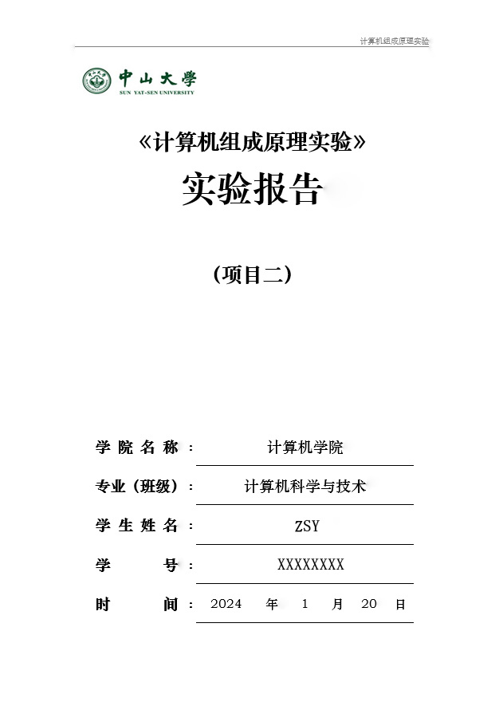
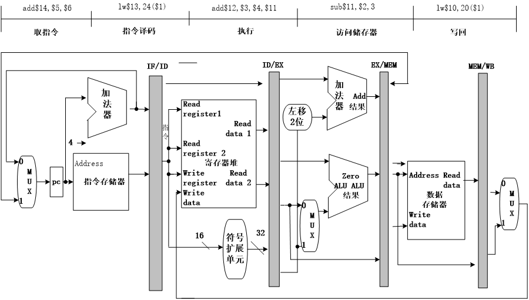

<div STYLE="page-break-after: always;"></div>

# 项目一：5级流水线CPU设计与实现

------

## 实验目的

1. **理解CPU基本结构与功能**：熟悉CPU的基本组成部分，包括指令寄存器、程序计数器、算术逻辑单元（ALU）、寄存器组等，理解它们在CPU中的作用和相互关系。
2. **掌握指令周期**：通过实验，学习CPU如何按照指令周期执行指令，包括取指、译码、执行、访存和写回。
3. **实践硬件描述语言（HDL）**：使用硬件描述语言（Verilog）来实现CPU设计，加深对HDL编程和数字逻辑设计的理解和应用。
4. **调试和验证**：学习如何使用仿真工具对CPU设计进行调试和验证，确保其正确执行各种指令。

## 实验内容

设计一个流水线CPU，从MIPS指令集中选取几条具有代表性的指令进行设计，该CPU能实现以下功能。

#### 指令与格式

##### **算数运算指令**

  1. <u>add  rd, rs, rt</u>

     | op     | rs   | rt   | rd   | shamt | func   |
     | ------ | ---- | ---- | ---- | ----- | ------ |
     | 000000 | 5位  | 5位  | 5位  | 00000 | 100000 |

  ​      功能：GPR[rd] ← GPR[rs] + GPR[rt]。  

  2. <u>sub  rd, rs, rt</u>

     | op     | rs   | rt   | rd   | shamt | func   |
     | ------ | ---- | ---- | ---- | ----- | ------ |
     | 000000 | 5位  | 5位  | 5位  | 00000 | 100010 |

​      功能：GPR[rd] ← GPR[rs] - GPR[rt]。

  3. <u>addiu  rt, rs, **immediate**</u> 

     | op     | rs   | rt   | immediate |
     | ------ | ---- | ---- | --------- |
     | 001001 | 5位  | 5位  | 16位      |

  ​      功能：GPR[rt] ← GPR[rs] + sign_extend(immediate)。

##### **逻辑运算指令**

  4. <u>andi  rt, rs, **immediate**</u>

     | op     | rs   | rt   | immediate |
     | ------ | ---- | ---- | --------- |
     | 001100 | 5位  | 5位  | 16位      |

  ​      功能：GPR[rt] ← GPR[rs] and zero_extend(immediate)。

  5. <u>and  rd, rs, rt</u>

     | op     | rs   | rt   | rd   | shamt | func   |
     | ------ | ---- | ---- | ---- | ----- | ------ |
     | 000000 | 5位  | 5位  | 5位  | 00000 | 100100 |

  ​      功能：GPR[rd] ← GPR[rs] and GPR[rt]。

  6. <u>ori  rt, rs, **immediate**</u>

     | op     | rs   | rt   | immediate |
     | ------ | ---- | ---- | --------- |
     | 001101 | 5位  | 5位  | 16位      |

  ​      功能：GPR[rt] ← GPR[rs] or zero_extend(immediate)。

  7. <u>or  rd, rs, rt</u>

     | op     | rs   | rt   | rd   | shamt | func   |
     | ------ | ---- | ---- | ---- | ----- | ------ |
     | 000000 | 5位  | 5位  | 5位  | 00000 | 100101 |

  ​      功能：GPR[rd] ← GPR[rs] or GPR[rt]。

  8. <u>xori  rt, rs, **immediate**</u>

     | op     | rs   | rt   | immediate |
     | ------ | ---- | ---- | --------- |
     | 001110 | 5位  | 5位  | 16位      |

  ​      功能：GPR[rt] ← GPR[rs] xor zero_extend(immediate)。

##### **移位指令**

  9. <u>sll  rd, rt, sa</u>

     | op     | rs    | rt   | rd   | shamt | func   |
     | ------ | ----- | ---- | ---- | ----- | ------ |
     | 000000 | 00000 | 5位  | 5位  | 5位   | 000000 |

  ​      功能：GPR[rd] ← GPR[rt] << shamt。

##### **比较指令**

  10. <u>slti  rt, rs, **immediate**   *带符号数*</u>

      | op     | rs   | rt   | immediate |
      | ------ | ---- | ---- | --------- |
      | 001010 | 5位  | 5位  | 16位      |

  ​      功能：if GPR[rs] < sign_extend(immediate)  GPR[rt] =1 else  GPR[rt] = 0。

<div STYLE="page-break-after: always;"></div>

  11. <u>slt  rd, rs, rt   *带符号数*</u>

      | op     | rs   | rt   | rd   | shamt | func   |
      | ------ | ---- | ---- | ---- | ----- | ------ |
      | 000000 | 5位  | 5位  | 5位  | 00000 | 101010 |

​        功能：if (GPR[rs] < GPR[rt]) GPR[rd] = 1 else (GPR[rd] = 0。

##### **存储器读/写指令**

  12. <u>sw  rt, **offset** (rs)  *写存储器*</u> 

      | op     | rs   | rt   | immediate |
      | ------ | ---- | ---- | --------- |
      | 101011 | 5位  | 5位  | 16位      |

​        功能：memory[GPR[base] + sign_extend(offset)] ← GPR[rt]。

  13. <u>lw  rt, **offset** (rs) *读存储器*</u>

      | op     | rs   | rt   | immediate |
      | ------ | ---- | ---- | --------- |
      | 100011 | 5位  | 5位  | 16位      |

​         功能：GPR[rt] ← memory[GPR[base] + sign_extend(offset)]。

##### **分支指令**

  14. <u>beq  rs, rt, **offset**</u>  

      | op     | rs   | rt   | immediate |
      | ------ | ---- | ---- | --------- |
      | 000100 | 5位  | 5位  | 16位      |

​        功能：if(GPR[rs] = GPR[rt])  pc ← pc + 4 + sign_extend(offset)<<2  else pc ← pc + 4

  15. <u>bne  rs, rt, **offset**</u>  

      | op     | rs   | rt   | offset |
      | ------ | ---- | ---- | ------ |
      | 000101 | 5位  | 5位  | 16位   |

​        功能：if(GPR[rs] != GPR[rt])  pc ← pc + 4 + sign_extend(offset) <<2  else pc ← pc + 4

  16. <u>bltz  rs, **offset**</u>  

      | op     | rs   | rt   | offset |
      | ------ | ---- | ---- | ------ |
      | 000110 | 5位  | 5位  | 16位   |

  ​      功能：if(GPR[rs] ≤ 0)  pc ← pc + 4 + sign_extend (offset) <<2  else pc ← pc + 4。

##### **跳转指令** 

  17. <u>j  **addr**</u>

      | op     | addr |
      | ------ | ---- |
      | 000010 | 26位 |

  ​      功能：PC ← {PC[31:28] , addr , 2’b0}，无条件跳转。

  18. <u>jr  rs</u>

      | op     | rs   | rt   | rd   | shamt | func   |
      | ------ | ---- | ---- | ---- | ----- | ------ |
      | 000000 | 5位  | 未用 | 未用 | 未用  | 001000 |

​        功能：PC ← GPR[rs]，跳转。

##### 调用子程序指令

  19. <u>jar  **addr**</u>

      | op     | addr |
      | ------ | ---- |
      | 000011 | 26位 |

​        功能：调用子程序，PC ← {PC[31:28] , **addr** , 2’b0}；**GPR[$31] ← pc+4**，返回地址设置；

​					子程序返回，需用指令 **jr $31**。跳转地址的形成同 **j addr** 指令。

##### **停机指令**

  20. <u>**halt**</u>

      | op     |                            |
      | ------ | -------------------------- |
      | 111111 | 00000000000000000000000000 |

  ​      功能：停机；不改变PC的值，PC保持不变。

#### 指令功能实现

依据以上指令要求设计出5级流水线CPU，实现元件间的连接，具体见**实验原理**部分

<div STYLE="page-break-after: always;"></div>

#### 仿真与测试流水线CPU

为了测试设计的流水线CPU能否正确运转，需要在CPU上运行一系列设计好的指令，指令码经过处理后以八位一行的形式放在 instructions.txt 中，CPU运行时被读进 instruction memories。

| **地址**       | **汇编程序**          | **指令代码** |           |           |                         |
| -------------- | --------------------- | ------------ | --------- | --------- | ----------------------- |
|                |                       | **op(6)**    | **rs(5)** | **rt(5)** | **rd(5)/immediate(16)** |
| **0x00000000** | addiu   $1,$0,8       | 001001       | 00000     | 00001     | 0000000000001000        |
| **0x00000004** | ori   $2,$0,2         | 001101       | 00000     | 00010     | 0000000000000010        |
| **0x00000008** | xori   $3,$2,8        | 001110       | 00010     | 00011     | 0000000000001000        |
| **0x0000000C** | sub   $4,$3,$1        | 000000       | 00011     | 00001     | 0010000000100010        |
| **0x00000010** | and   $5,$4,$2        | 000000       | 00100     | 00010     | 0010100000100100        |
| **0x00000014** | sll  $5,$5,2          | 000000       | 00000     | 00101     | 0010100010000000        |
| **0x00000018** | beq $5,$1,-2(=,转14)  | 000100       | 00101     | 00001     | 1111111111111110        |
| **0x0000001C** | jal 0x0000050         | 000011       | 00000     | 00000     | 0000000001010000        |
| **0x00000020** | slt   $8,$13,$1       | 000000       | 01101     | 00001     | 0100000000101010        |
| **0x00000024** | addiu $14,$0,-2       | 001001       | 00000     | 01110     | 1111111111111110        |
| **0x00000028** | slt   $9,$8,$14       | 000000       | 01000     | 01110     | 0100100000101010        |
| **0x0000002C** | slti   $10,$9,2       | 001010       | 01001     | 01010     | 0000000000000010        |
| **0x00000030** | slti   $11,$10,0      | 001010       | 01010     | 01011     | 0000000000000000        |
| **0x00000034** | add   $11,$11,$10     | 000000       | 01011     | 01010     | 0101100000100000        |
| **0x00000038** | bne $11,$2,-2(≠,转34) | 000101       | 01011     | 00010     | 1111111111111110        |
| **0x0000003C** | addiu   $12,$0,-2     | 001001       | 00000     | 01100     | 1111111111111110        |
| **0x00000040** | addiu   $12,$12,1     | 001001       | 01100     | 01100     | 0000000000000001        |
| **0x00000044** | bltz $12,-2 (<0,转40) | 000110       | 01100     | 00000     | 1111111111111110        |
| **0x00000048** | andi   $12,$2,2       | 001100       | 00010     | 01100     | 0000000000000010        |
| **0x0000004C** | j  0x000005C          | 000010       | 00000     | 00000     | 0000000001011100        |
| **0x00000050** | sw   $2,4($1)         | 101011       | 00001     | 00010     | 0000000000000100        |
| **0x00000054** | lw   $13,4($1)        | 100011       | 00001     | 01101     | 0000000000000100        |
| **0x00000058** | jr  $31               | 000000       | 11111     | xxxxx     | xxxxxxxxxx001000        |
| **0x0000005C** | halt                  | 111111       | 00000     | 00000     | 0000000000000000        |

<div STYLE="page-break-after: always;"></div>

#### Basys3 开发板烧录

- **显示数据说明：** 指令存储器中的指令地址范围：0 ~ 255；数据存储器中的数据地址范围：0 ~ 255。也就是只使用低8位。故在开发板上以十六进制显示时仅需两位即可。

- **数码管开关说明：**（以下数据都来自CPU）（SW15、SW14、SW0为Basys3板上开关名，BTNR为按键名）    
- **<u>开关SW_in</u>** (SW15、SW14)状态情况如下。

- **显示格式：** 左边两位数码管BB  :  右边两位数码管BB。以下是数码管的显示内容。
  - **SW_in = 00：** 显示 当前 PC值:下条指令PC值    
  - **SW_in = 01：** 显示 RS寄存器地址:RS寄存器数据    
  - **SW_in = 10：** 显示 RT寄存器地址:RT寄存器数据    
  - **SW_in = 11：** 显示 ALU结果输出 :DB总线数据。 

- **其他控制开关说明：**
  - **<u>复位信号（reset）</u>** 接开关SW0
  - **<u>按键（单脉冲）</u>** 接按键BTNR。


- **数码管说明**：

  - 7段数码管的位控信号AN3-AN0，每组编码中只有一位为0（亮），其余都是1（灭）。
  - 七段数码显示器编码与引脚对应关系为（左到右，高到低）：七段共阳极数码管->1gfedcba

- 必须有足够的刷新频率，频率太高或太低都不成，系统时钟必须适当分频，否则效果达不到。

  - 每个按键周期，4个数码管都必须刷新一次。数码管位控信号     AN3-AN0是 1110、1101、1011、0111，为0时点亮该数码管。

  


<div STYLE="page-break-after: always;"></div>

**Basys3 板烧录说明**

- Basys3 板上需要两个时钟，一个用于控制数码管的扫描，用Basys3 板系统时钟经过分频得到并输入计数器，产生位控信号。另一个为单脉冲，用于控制PC更新，需用按键信号经过消抖得到。
- 生成计数器，计数器用于产生4个数。这4数用于控制4个数码管。
- 根据计数器产生的数生成数码管相应的位控信号（输出）和接收CPU来的相应数据。
- 将从CPU 接收到的相应数据转换为数码管显示信号，再送往数码管显示（输出）
- **引脚分配**


<div STYLE="page-break-after: always;"></div>

## 实验原理

#### 5级流水线CPU简介

为提高CPU的运行速度，在单周期的基础上将指令的执行周期划分为**取指、译码、执行、访存、写回五个阶段**，每个阶段占用一个时钟周期，这样就可以减少不必要的阶段，并通过提高主频提高CPU的整体运行速度。进一步为了减少硬件的闲置，流水线CPU的每一个阶段都有一条指令在CPU上执行，而非像单周期和多周期CPU一样等待前一条指令执行完成后才开始执行下一条指令。这种设计方式能够提高CPU的运行速度，但由于多条指令同时在CPU上执行，可能会出现冲突的情况，在这里我采用了**旁路转发、硬件阻塞和静态分支预测**的方法处理这些冲突。

#### 流水线CPU的时钟策略

不同层次的存储器访问速度不同，比如芯片外的高速缓存（SRAM）的访问通常需要1 ~ 30个时钟周期，主存储器（DRAM）访问需要50 ~ 200个时钟周期，而本地的二级存储（磁盘）的访问通常需要上千万个时钟周期。为了保证每个阶段都能够在一个时钟周期内执行完成，必须选择执行时间最长的访存阶段（MEM）作为5级流水线CPU的时钟周期。在这里我们不考虑需要访问主存或外存的状况，而是假设一级缓存的命中率为100%，故设计中的数据和指令存储器采用寄存器的形式设计，并不考虑由于访问主存等带来的异常处理。

在5级流水线中，每条指令被分为取指、译码、执行、访存、写回5个阶段，每个阶段占用一个时钟周期，每个时钟周期都有一条指令被取出，故在同一时刻CPU上有5条指令在执行。每个阶段设置一个寄存器，当**时钟下降沿**到来的时候，每个流水段的寄存器和PC都进行更新，处理结果被写入流水段寄存器中，并进入下一个阶段的运行。

为避免写回的数据与取出的数据发生冲突，这里采取**时钟上升沿写入**的方法，使得写回通用寄存器堆的数据在前半个时钟周期就被写入，而后半个时钟周期用于读出数据。数据存储器的读写同样也是如此。


由于写地址与写使能信号之间存在竞争关系，如果写使能信号比写地址先到达寄存器堆或数据存储器，则有可能将数据写入错误的地址，故要在写地址到达后再让写使能信号有效。与多周期CPU不同的是，由于流水线CPU每个阶段都有一条指令在执行，即每个时钟周期都有一条指令再访存阶段，不能让写地址提前一个时钟周期到达，否则会导致上一条指令的访存出现错误，所以**将写使能信号与时钟信号做与运算**，作为新的写使能信号，保证在时钟上升沿到达后再写入。


#### 流水线CPU的工作流程

具体来说，流水线CPU在一个时钟周期内完成某条指令取指，译码，执行，访存，写回中的一个阶段，共有5条指令在执行，**工作流程**如下：

1. **取指令（IF)**：根据程序计数器（PC）中的地址，从指令存储器中取出一条指令。
2. **指令译码(ID)**：由取出的指令生成各种控制信号，明确该指令要进行的行为。
3. **执行(EXE)**：对指令的各种操作数进行运算，例如算术逻辑操作。
4. **存储器访问(MEM)**：将数据写入存储器或从存储器中读出数据。
5. **写回(WB)**：将指令运算结果存入指定的寄存器。

#### 数据通路的建立

为了完成以上任务，我们需要建立对数据的处理通路。在这个通路中，每个时钟周期都需要执行一个流水阶段，且每个阶段都有指令在执行，意味着每个元件在一条指令执行过程中都只能使用一次，否则就会出现两条指令共用一个元件的情况。如需要使用多次则需将此单元复制多份。在多周期CPU 中，一条指令在多个时钟周期下完成，且同一时间只有一条指令在执行，故可以将指令存储器与数据存储器合并。而在流水线CPU中，为避免在取指阶段的指令与在访存阶段的指令同时访问存储器的情况，需要将指令存储器与数据存储器分开。同时为了尽可能减少元件数量，不同指令之间需要共享相同的元件，通过数据选择器选择不同的数据输入。

同时为了将不同执行阶段的指令分开，使它们不互相影响，需在每个指令阶段的数据通路后添加一个流水段寄存器，保存当前阶段的数据输入。

在单周期CPU的基础上，经过修改调整得到流水线CPU的数据通路如下：



#### 控制器的实现

由于不同的指令可能需要使用相同的元件以减少模块的数量，为了控制元件在不同指令下的行为，需要设置指令码。指令码由控制器产生，根据指令的 op 码和 function 码产生对应的信号。

在这里我采用了 **主控 + 局部控制** 的设计方式，主控输入 op 码，输出控制信号与 ALUOp 码，局部控制接收 ALUOp 码和 function 码，输出 ALUCtr 实现对 ALU 的单独控制。在 op 码不为 000000 的情况下，function 码不起作用。

同时，在控制信号的产生方式中，我选择使用逻辑电路的方式，每个控制信号由指令**经过逻辑门电路处理产生**，而非使用 case 语句从每个类性的 op 码中产生对应的控制信号，因而不需要使用控存，取值速度更快。与多周期CPU不同，流水线CPU的指令控制码是一次产生的，不需要像多周期CPU一样使用状态机或微程序完成。

与单周期CPU的控制单元不同，流水线CPU中一条指令的控制码不是同时到达所有运算元件的，而是要与操作数一起，经过不同时钟周期的阻塞，到达相应的元件。故在译码阶段得到控制码后，控制码需和操作数一起存入流水段寄存器中，并和数据一起输入到元件中。指令的取值和译码阶段不需要控制码。

##### 控制信号的解释

- ExtSrc：立即数扩展控制
  - 0：零扩展
  - 1：符号位扩展
- Reset：PC清零信号
  - 0：清零
  - 1：不清零
- PCWrite：PC写入控制
  - 0：不写入下条PC值
  - 1：写入下条PC值
- PCSrc：下条PC计算方式选择
  - 00：PC + 4
  - 01：跳转
  - 10：无条件跳转
  - 11：从子程序返回
- zeroOp：相等判断类型
  - 00：beq
  - 01：bne
  - 10：bltz
  - 11：/
- MemWrite：数据存储器写控制
  - 0：不写入
  - 1：写入
- MemRead：数据存储器读控制
  - 0：不读出
  - 1：读出
- InsMemRW：指令存储器读写控制
  - 0：写入
  - 1：读出
- MemtoReg：总线数据选择
  - 00：将 ALU 输出写回寄存器
  - 01：将数据存储器输出写回寄存器
  - 10：将PC+4写入寄存器（子程序调用返回地址）
  - 11：/
- RegWrite：寄存器写控制
  - 0：不写入
  - 1：写入
- RegDst：寄存器写入地址选择
  - 00：写入 rt
  - 01：写入 rd
  - 10：写入$31（PC返回地址）
  - 11：/
- ALUSrcA：ALU 输入选择1
  - 0：输入寄存器A口数据
  - 1：输入移位字段
- ALUSrcB：ALU 输入选择2
  - 0：输入寄存器B口数据
  - 1：输入扩展后的立即数
- ALUOp：ALU 局部控制的控制信号
- ALUctr：ALU 控制信号

<div STYLE="page-break-after: always;"></div>

##### Control Unit

| R型指令  | Sign0Ext | PC       | PC    | PC      | PC       |
| -------- | -------- | -------- | ----- | ------- | -------- |
| 指令名称 | ExtSrc   | InsMemRW | Reset | PCWrite | PCSrc(2) |
| add      | x        | 1        | 1     | 1       | 00       |
| sub      | x        | 1        | 1     | 1       | 00       |
| and      | x        | 1        | 1     | 1       | 00       |
| or       | x        | 1        | 1     | 1       | 00       |
| slt      | x        | 1        | 1     | 1       | 00       |
| sll      | x        | 1        | 1     | 1       | 00       |
| jr       | x        | 1        | 1     | 1       | 11       |
|          |          |          |       |         |          |
| I型指令  |          |          |       |         |          |
| addiu    | 1        | 1        | 1     | 1       | 00       |
| andi     | 0        | 1        | 1     | 1       | 00       |
| ori      | 0        | 1        | 1     | 1       | 00       |
| xori     | 0        | 1        | 1     | 1       | 00       |
| slti     | 1        | 1        | 1     | 1       | 00       |
| lw       | 1        | 1        | 1     | 1       | 00       |
| sw       | 1        | 1        | 1     | 1       | 00       |
| beq      | 1        | 1        | 1     | 1       | 01       |
| bne      | 1        | 1        | 1     | 1       | 01       |
| bltz     | 1        | 1        | 1     | 1       | 01       |
|          |          |          |       |         |          |
| J型指令  |          |          |       |         |          |
| jump     | x        | 1        | 1     | 1       | 10       |
| jal      | x        | 1        | 1     | 1       | 10       |
|          |          |          |       |         |          |
| halt     | x        | 1        | 0     | 0       | xx       |

| R型指令  | DataMemory | InsMemory | InsMemory |
| -------- | ---------- | --------- | --------- |
| 指令名称 | MemWrite   | MemRead   | InsMemRW  |
| add      | 0          | 0         | 1         |
| sub      | 0          | 0         | 1         |
| and      | 0          | 0         | 1         |
| or       | 0          | 0         | 1         |
| slt      | 0          | 0         | 1         |
| sll      | 0          | 0         | 1         |
| jr       | 0          | 0         | 1         |
|          |            |           |           |
| I型指令  |            |           |           |
| addiu    | 0          | 0         | 1         |
| andi     | 0          | 0         | 1         |
| ori      | 0          | 0         | 1         |
| xori     | 0          | 0         | 1         |
| slti     | 0          | 0         | 1         |
| lw       | 0          | 1         | 1         |
| sw       | 1          | 0         | 1         |
| beq      | 0          | 0         | 1         |
| bne      | 0          | 0         | 1         |
| bltz     | 0          | 0         | 1         |
|          |            |           |           |
| J型指令  |            |           |           |
| jump     | 0          | 0         | 1         |
| jal      | 0          | 0         | 1         |
|          |            |           |           |
| halt     | 0          | 0         | 1         |

| R型指令  | Zero      | RegFile     | RegFile  | RegFile   |
| -------- | --------- | ----------- | -------- | --------- |
| 指令名称 | zeroOp(2) | MemtoReg(2) | RegWrite | RegDst(2) |
| add      | xx        | 00          | 1        | 01        |
| sub      | xx        | 00          | 1        | 01        |
| and      | xx        | 00          | 1        | 01        |
| or       | xx        | 00          | 1        | 01        |
| slt      | xx        | 00          | 1        | 01        |
| sll      | xx        | 00          | 1        | 01        |
| jr       | xx        | xx          | 0        | xx        |
|          |           |             |          |           |
| I型指令  |           |             |          |           |
| addiu    | xx        | 00          | 1        | 00        |
| andi     | xx        | 00          | 1        | 00        |
| ori      | xx        | 00          | 1        | 00        |
| xori     | xx        | 00          | 1        | 00        |
| slti     | xx        | 00          | 1        | 00        |
| lw       | xx        | 01          | 1        | 00        |
| sw       | xx        | xx          | 0        | xx        |
| beq      | 00        | xx          | 0        | xx        |
| bne      | 01        | xx          | 0        | xx        |
| bltz     | 10        | xx          | 0        | xx        |
|          |           |             |          |           |
| J型指令  |           |             |          |           |
| jump     | xx        | xx          | 0        | xx        |
| jal      | xx        | 10          | 1        | 10        |
|          |           |             |          |           |
| halt     | xx        | xx          | 0        | xx        |

<div STYLE="page-break-after: always;"></div>

##### ALU Control

| R型指令  | ALU     | ALU     | ALU         | ALU      | ALU    | ALU       |
| -------- | ------- | ------- | ----------- | -------- | ------ | --------- |
| 指令名称 | ALUSrcA | ALUSrcB | ALUOp(sign) | ALUOp(4) | funct  | ALUctr(3) |
| add      | 0       | 0       | +           | 1xxx     | 100000 | 000       |
| sub      | 0       | 0       | -           | 1xxx     | 100010 | 001       |
| and      | 0       | 0       | &           | 1xxx     | 100100 | 010       |
| or       | 0       | 0       | \|          | 1xxx     | 100101 | 011       |
| slt      | 0       | 0       | <           | 1xxx     | 101010 | 101       |
| sll      | 1       | 0       | <<          | 1xxx     | 000000 | 100       |
| jr       | x       | x       | x           | xxxx     | 001000 | xxx       |
|          |         |         |             |          |        |           |
| I型指令  |         |         |             |          |        |           |
| addiu    | 0       | 1       | +           | 0000     | xxxxxx | 000       |
| andi     | 0       | 1       | &           | 0010     | xxxxxx | 010       |
| ori      | 0       | 1       | \|          | 0011     | xxxxxx | 011       |
| xori     | 0       | 1       | ^           | 0111     | xxxxxx | 111       |
| slti     | 0       | 1       | <           | 0101     | xxxxxx | 101       |
| lw       | 0       | 1       | +           | 0000     | xxxxxx | 000       |
| sw       | 0       | 1       | +           | 0000     | xxxxxx | 000       |
| beq      | 0       | 0       | -           | 0001     | xxxxxx | 001       |
| bne      | 0       | 0       | -           | 0001     | xxxxxx | 001       |
| bltz     | 0       | 0       | <=          | 0110     | xxxxxx | 110       |
|          |         |         |             |          |        |           |
| J型指令  |         |         |             |          |        |           |
| jump     | x       | x       | x           | xxxx     | xxxxxx | xxx       |
| jal      | x       | x       | x           | xxxx     | xxxxxx | xxx       |
|          |         |         |             |          |        |           |
| halt     | x       | x       | x           | xxxx     | xxxxxx | xxx       |

#### 流水线冒险与冲突处理

##### Structural hazards 结构冒险

在流水线CPU中，一个时钟周期内有多条指令在CPU上运行，若一个功能部件同时被多条指令使用，则会产生结构冒险（或称资源冲突）。为了流水线能顺利工作，规定：

- 每个功能部件每条指令只能用一次（e.g. 写口不能用两次或以上 写口不能用两次或以上）
- 每个功能部件必须在相同的阶段被使用（e.g. 写口总是在第五阶段被使用 写口总是在第五阶段被使用）

为解决结构冒险，采取了以下措施：

- 在流水线CPU设计中，将数据存储器与指令存储器分开，数据存储器只在第四阶段被使用，指令存储器只在第一阶段被使用
- 将寄存器堆的写口与读口分开，写口只在第五阶段被使用，读口只在第二阶段被使用，避免出现既有数据输入又有数据被读出的情况。
- 计算PC自增的加法器独立于ALU设置，避免于第三阶段的指令发生冲突。
- 将每条指令都用空阶段NOP补齐为5个时钟周期，让流水线更规整。

##### Data hazards 数据冒险

在流水线CPU中可能出现后一条指令需要用到的操作数还在前一条指令的运算中没有产生，或没有写回寄存器堆的情况（即“写后读"，RAW）。指令取出的值为该地址下的老值，而新值还未写回，会导致该指令的运算结果错误。简单的阻塞方式通过插入三条NOP指令阻塞三个时钟周期，等待新值写回寄存器堆后再取出，但这种方法效率低下，不符合设计流水线CPU的初衷，故我采用了旁路转发加硬件阻塞的方法解决数据冒险的问题。


- 如果指令**需要写寄存器堆**，且**目标寄存器**是**下一条指令的源寄存器**，或**下下条指令的源寄存器**，就要进行转发。

- 如果是**load-use型的冲**突，且目的寄存器是下一条指令的源寄存器，则还需要**阻塞一个时钟周期**。

- 如果指令的源寄存器是上条指令和上上条指令的目标寄存器，则对上条指令的运算结果进行转发，而不对上上条指令的结果进行转发。
- **$0 寄存器的值永远为0**

归结为一下几种情况：

- 目标寄存器是下一条指令的源寄存器，写回ALU数据：	通过C1转发
- 目标寄存器是下下条指令的源寄存器，写回ALU数据：    通过C2转发
- 目标寄存器是下一条指令的源寄存器，写回MEM数据：  通过C3转发，阻塞一个时钟周期
- 目标寄存器是下下条指令的源寄存器，写回MEM数据：  通过C3转发

其中C2、C3可通过从总线转发合并。

阻塞的方法为将ID/EX段寄存器中所有控制信号清0，IF/ID寄存器中的信息不变，PC中的值不变。 

故转发条件为：

-  C1: 	EX/MEM_RegWrite and EX/MEM_ RegisterRd ≠ 0  and  (EX/MEM_RegisterRd=ID/EX_RegisterRs or     EX/MEM_RegisterRd=ID/EX_RegisterRt)
- C2：   MEM/WB_RegWrite and MEM/WB_RegisterRd ≠ 0  and  (MEM/WB_RegisterRd=ID/EX_RegisterRs or MEM/WB_RegisterRd=ID/EX_RegisterRt)

##### Control hazards 控制冒险

若一条指令是分支跳转指令，从它取指到PC跳转到指定位置要经过三个时钟周期，第四个时钟周期读入的指令才是应该跟在分支跳转指令后执行的指令。而跳转前执行的三条指令都应该作废，浪费了三个时钟周期。我采取静态分支预测技术，总是预测条件不满足(not taken)，即继续执行分支指令的后续指令，将跳转地址计算提前到译码阶段，可以减少预测失败带来的时间损失。

由于在第二阶段译码已经完成，可以得到跳转后的地址，同时在第二阶段计算得到是否满足分支条件，可以直接在前两个阶段完成PC跳转，这样就只需将后一条指令转化为NOP指令，损失减小为一个时钟周期。

若不满足分支条件，则直接按顺序执行，静态分支预测部分不工作。若满足分支条件，则需要将IF/ID中的指令字清0 , 转变为NOP指令。

在静态分支预测的过程中也要考虑数据冒险的情况，故也应该设置来自第四第五阶段的转发。


<div STYLE="page-break-after: always;"></div>

#### 5级流水线CPU的电路图


<div STYLE="page-break-after: always;"></div>

## 实验器材

- PC机一台
- BASYS 3 实验板一块
- Xilinx Vivado 开发软件一套

### 元件设计与连接

#### 寄存器堆---Register File

##### 接口说明

- 输入---Input
  - rs：操作数 rs 寄存器地址
  - rt：操作数 rt 寄存器地址
  - writeSrc：写入的寄存器地址
  - CLK：时钟信号（用于控制寄存器写入）
  - RegWrite：寄存器写入控制
  - MemtoReg：总线数据（写入寄存器）选择
  - ALUData：ALU 运算结果
  - DMData：数据存储器读出
  - nextPC4：返回地址保存
- 输出---Output
  - readData1：寄存器输出数据1
  - readData2：寄存器输出数据2
  - DBData：总线数据（写入数据）

##### 模块代码---RegFile.v

```verilog
module RegFile(
    input CLK, RegWrite,//控制指令
    input [1:0] MemtoReg,//数据选择
    input [4:0] rs, rt, writeSrc,//操作数地址
    input [31:0] ALUData, DMData, nextPC4,//需要写入寄存器的数据
    
    output [31:0] readData1, readData2,//rs, rt操作数
    output [31:0] DBData//总线数据 
    );
    
    //控制码选择数据
    assign DBData = (MemtoReg[0]) ? DMData : ((MemtoReg[1]) ? nextPC4 : ALUData);
    
    //创建寄存器本体
    reg [31:0] register[0:31];
    
    integer i;//用于遍历寄存器
    initial begin 
        for (i = 0; i < 32; i = i + 1) begin
            register[i] <= 0;
        end
    end
    
    assign readData1 = register[rs];//输出rs对应操作数
    assign readData2 = register[rt];//输出rt对应操作数
    
    always @ (posedge CLK) begin//写入数据到寄存器
        if (RegWrite && CLK && (writeSrc != 5'b00000)) begin
            register[writeSrc] <= DBData;
        end
    end
    
endmodule
```

#### 指令存储器---Instruction Memory

##### 接口说明

- 输入---Inputs
  - InMemRW：指令存储器读写控制
  - InsAddr：指令地址
- 输出---Outputs
  - readIns：取出的指令码

##### 模块代码---Instruction_Memory.v

```verilog
module Instruction_Memory(
    input InsMemRW,//控制指令
    input [31:0] InsAddr,//需要取出的指令地址（32位）
    
    //取出指令（32位）
    output [31:0] readIns
    );

//存储器本体
 reg [7:0] Mem [0:127];
 reg [31:0] outIns;//输出的数据
 integer i;//用于遍历存储器
 
 //从存储器输出分配命令字段
 assign readIns = outIns [31:0];

initial begin
    $readmemb("D:/UserDFile/VivadoFile/Multi_cycle_CPU/Instructions.txt", Mem);//从文件中读取指令集
    
    for (i = 0; i < 128; i = i + 1) begin
        $display("Mem[%0d] = %08b", i, Mem[i]);
    end

    outIns = 0;//指令初始化
end

//根据PC地址从8位一行读出完整指令
always @ (InsAddr or InsMemRW) begin
    if (InsMemRW == 1) begin
        outIns [7:0] = Mem[InsAddr + 3];
        outIns [15:8] = Mem[InsAddr + 2];
        outIns [23:16] = Mem[InsAddr + 1];
        outIns [31:24] = Mem[InsAddr];
     end
 end
 
endmodule
```

#### 数据存储器--Data Memory

##### 接口说明

- 输入---Inputs
  - CLK：时钟信号（用于数据存储器写入控制）
  - MemWrite：存储器写入控制
  - MemRead：存储器读出控制
  - writeData：需要写入存储器的数据
  - DataAddr：读写数据地址
- 输出---Outputs
  - readData：读出的存储器数据

##### 模块代码---Data_Memory.v

```verilog
module Data_Memory(
    input CLK, MemWrite, MemRead,//控制信号
    input [31:0] writeData,//需要写入数据存储器的数据
    input [31:0] DataAddr,//数据目标地址
    
    output [31:0] readData//读出的数据
    );
    
reg [7:0] Memory [0:127];//创建存储器本体
wire [31:0] address;//存储单元地址编码

//存储地址是4的倍数
assign address = (DataAddr << 2);

//读数据
assign readData [7:0] = (MemRead == 1) ? Memory[address + 3] : 8'bz;
assign readData [15:8] = (MemRead == 1) ? Memory[address + 2] : 8'bz;
assign readData [23:16] = (MemRead == 1) ? Memory[address + 1] : 8'bz;
assign readData [31:24] = (MemRead == 1) ? Memory[address] : 8'bz;

//写数据
always @ (posedge CLK) begin
    if (MemWrite && CLK) begin
        Memory[address] <= writeData [31:24];
        Memory[address + 1] <= writeData [23:16];
        Memory[address + 2] <= writeData [15:8];
        Memory[address + 3] <= writeData [7:0];
    end
end

endmodule
```

#### 立即数扩展---Sign_Zero_Extend

##### 接口说明

- 输入---Inputs
  - ExtSrc：扩展方式选择
  - Immediate：立即数
- 输出---Outputs
  - ImExtend：扩展结果

##### 模块代码---Sign_Zero_Extend.v

```verilog
module Sign_Zero_Extend(
    input ExtSrc,//控制信号
    input [15:0] Immediate,//立即数输入
    
    output [31:0] ImExtend//输出扩展后的数
    );
    
    //立即数扩展
    assign ImExtend [15:0] = Immediate [15:0];
    assign ImExtend [31:16] = ExtSrc == 1 ? {16{Immediate[15]}} : 16'b0000_0000_0000_0000;

endmodule
```

#### 运算模块---ALU

##### 接口说明

- 输入---Inputs
  - ALUSrcA：输入ALU的数据选择A
  - ALUSrcB：输入ALU的数据选择B
  - forward_EXE_A：转发位置选择控制信号A
  - forward_EXE_B：转发位置选择控制信号B
  - ALUCtr：ALU控制信号
  - readDataA：操作数A
  - readDataB：操作数B
  - MEMforwardData：从第四阶段转发的操作数
  - WBforwardData：从第五阶段转发的操作数
  - ImExtend：立即数扩展结果
  - shamt：移位字段
- 输出---Outputs
  - ALUData：运算结果
  - updateDataA：经转发更新后的新值A，用于输出到数码管
  - updateDataB：经转发更新后的新值B，用于输出到数码管

##### 模块代码---ALU.v

```verilog
module ALU(
    input ALUSrcA, ALUSrcB,//控制信号，输入选择
    input [1:0] forward_EXE_A, forward_EXE_B,//转发信号选择
    input [2:0] ALUCtr,//ALU运算控制
    input [31:0] readDataA, readDataB,//从流水寄存器中读出的数据
    input [31:0] MEMforwardData, WBforwardData,//转发信号
    input [4:0] shamt,//移位字段
    input [31:0] ImExtend,//立即数扩展
    
    output reg [31:0] ALUData,//运算结果
    output [31:0] updateDataA, updateDataB//更新后的数据，用于输出到数码管上
    );
    
    //转发更新后的数据
    assign updateDataA = (forward_EXE_A[0]) ? MEMforwardData : ((forward_EXE_A[1]) ? WBforwardData : readDataA);
    assign updateDataB = (forward_EXE_B[0]) ? MEMforwardData : ((forward_EXE_B[1]) ? WBforwardData : readDataB);
    wire [31:0] inDataA, inDataB;
    assign inDataA = ALUSrcA ? {{27{1'b0}}, shamt} : updateDataA;
    assign inDataB = ALUSrcB ? ImExtend : updateDataB;
    
//    assign outupdateDataB = updateDataB;
    wire smaller;
    assign smaller = (inDataA < inDataB) ? 1 : 0;
    
    always @ (*) begin 
        case (ALUCtr)
            3'b000: ALUData = inDataA + inDataB;
            3'b001: ALUData = inDataA - inDataB;
            3'b010: ALUData = inDataA & inDataB;
            3'b011: ALUData = inDataA | inDataB;
            3'b100: ALUData = inDataB << inDataA;
            3'b101: ALUData = (inDataA[31] == 0 && inDataB[31] == 0) ? {{31{1'b0}}, smaller} : {{31{1'b0}}, ~smaller};
            3'b110: ALUData = inDataA > inDataB;
            3'b111: ALUData = inDataA ^ inDataB;
            default: ALUData = 32'h0000;
        endcase
    end
    
endmodule
```

#### 程序计数器---PC

##### 接口说明

- 输入---Inputs
  - CLK：时钟信号，控制PC 更新
  - Reset：清零信号
  - PCWrite_C：PC更新控制(Control Unit)
  - PCWrite_HD：PC更新控制(Hazard Detection)
  - zero：条件分支控制（静态分支预测产生）
    - 0：不满足条件
    - 1：满足条件
  - PCSrc：PC跳转选择
  - Immediate：立即数输入（用于条件跳转）
  - JumpPC：跳转目标地址（用于无条件跳转）
  - storeDataA：寄存器读出的指令地址（子程序返回）
  - outnextPC4：经过IF_ID寄存器后的 PC+4（用于静态分支预测成功，等于当前PC）
- 输出---Outputs
  - InsAddr：指令地址
  - nextPC：下条指令地址（等待更新写入，不一定是PC+4）
  - nextPC4：未经过IF_ID寄存器的PC+4（用于更新PC）

##### 模块代码---PC.v

```verilog
module PC(
    input CLK, Reset, PCWrite_C, PCWrite_HD,//控制参数
    input zero,//条件分支控制
    input [1:0] PCSrc,//PC种类选择
    input [31:0] ImExtend,//立即数,这里可能需要修改(移位？符号）
    input [31:0] JumpPC,//PC无条件跳转
    input [31:0] storeDataA,//寄存器读出的指令地址，用于jr指令
    input [31:0] outnextPC4,//经过IF_ID寄存器后的PC + 4
    
    output reg signed [31:0] InsAddr,//需要取出的指令地址
    output [31:0] nextPC4,//InsAddr + 4(未经过IF_ID寄存器的PC + 4）
    output [31:0] nextPC//等待写入的PC值,也用于输出到数码管
    );

    wire [31:0] branchPC;
    
    //输出数据计算
    assign nextPC4 = InsAddr + 4;
    assign branchPC = (zero) ? outnextPC4 + (ImExtend << 2) : outnextPC4 + 4;
    assign nextPC = (PCSrc == 2'b11) ? storeDataA : ((PCSrc == 2'b10) ? JumpPC : ((PCSrc == 2'b01) ? branchPC : InsAddr + 4));
    
    //指令地址更新
    always @ (negedge CLK or negedge Reset) begin
        if (Reset == 0)
            InsAddr = 0;
        else if (PCWrite_C && PCWrite_HD) begin
            if (PCSrc == 2'b11)
                InsAddr = storeDataA;
            else if (PCSrc == 2'b10)
                InsAddr = JumpPC;
            else if (PCSrc == 2'b01)
                InsAddr = branchPC;
            else
                InsAddr = InsAddr + 4;
            end
        end
        
endmodule
```

#### IF/ID流水段寄存器---IF_ID_register

##### 接口说明

- 输入---Inputs
  - CLK：时钟信号
  - IF_ID_Write：写控制信号
  - zero：分支预测成败
  - PCSrc：PC更新选择
  - nextPC4：输入的下条PC值
  - readIns：IF阶段读出的指令
- 输出---Outputs
  - outnextPC4：输出的下条PC值
  - 其它均为指令字段

##### 模块代码---IF_ID_reg.v

```verilog
module IF_ID_reg(
    input CLK, //时钟信号
    input IF_ID_Write,//写使能
    input zero,//分支预测情况
    input [1:0] PCSrc,//PC更新选择，是否跳转
    input [31:0] nextPC4,//下条PC
    input [31:0] readIns,//IF阶段读出的指令
    
    //取出指令（32位）
    output [31:0] outnextPC4,//读出下条PC
    output [5:0] op,//[31:26] op
    output [4:0] rs, rt, rd,//[25:21] rs; [20:16] rt; [15:11] rd
    output [4:0] shamt,//[10:6] shamt
    output [5:0] func,//[5:0] func
    output [15:0] Immediate,//[15:0] immediate
    output [31:0] JumpPC//PC跳转地址
    );
    
    //初始化流水寄存器本体
    reg [31:0] IF_ID_Ins;//流水寄存器存储的指令
    reg [31:0] IF_ID_PC;//流水寄存器存储的下条PC
    
    initial 
        begin
            IF_ID_Ins <= 0;
            IF_ID_PC <= 0;
        end
    
    //从寄存器输出分配字段
    assign outnextPC4 = IF_ID_PC [31:0];
    assign op = IF_ID_Ins [31:26];
    assign rs = IF_ID_Ins [25:21];
    assign rt = IF_ID_Ins [20:16];
    assign rd = IF_ID_Ins [15:11];
    assign shamt = IF_ID_Ins [10:6];
    assign func = IF_ID_Ins [5:0];
    assign Immediate = IF_ID_Ins [15:0];
    assign JumpPC = {{IF_ID_PC[31:28]},{2'b00},{IF_ID_Ins[25:2]},{2'b00}};
    
    //状态变化：时钟下降沿改变
    always @ (negedge CLK) begin
        if ((IF_ID_Write == 1) && (((zero == 1) && (PCSrc == 2'b01)) || (PCSrc[1] == 1))) begin
            IF_ID_Ins <= 0;
        end
        else if (IF_ID_Write == 1) begin
            IF_ID_Ins <= readIns;
            IF_ID_PC <= nextPC4;
        end
    end
    
endmodule
```

#### ID/EXE流水段寄存器---ID_EXE_register

##### 接口说明

- 输入---Inputs
  - CLK：时钟信号
  - ID_EXE_Flush：清零控制信号
  - ID_rs：第二阶段的源寄存器rs地址（用于静态分支预测）
  - ID_rt：第二阶段的源寄存器rt地址（用于静态分支预测）
  - zeroOp：分支类型判断
  - RegDst：寄存器堆写地址选择
  - readDataA：寄存器堆读出的信号A
  - readDataB：寄存器堆读出的信号B
  - MEMforwardData：来自第四阶段的转发信号
  - WBforwardData：来自第五阶段的转发信号
  - rs, rt, rd, shamt：均为指令字段
  - ImExtend：立即数扩展
  - nextPC4：下条PC值
  - ALUSrcA, ALUSrcB, ALUCtr, MemWrite, MemRead, MemtoReg, RegWrite：均为控制信号
- 输出---Outputs
  - outDataA：ALU操作数A
  - outDataB：ALU操作数B
  - outwriteSrc：寄存器堆写地址
  - outrs, outrt：均为输出指令字段（用于判断转发）
  - outnextPC4：输出下条PC值
  - outshamt：输出移位字段
  - outImExtend：输出立即数开展
  - outALUSrcA, outALUSrcB, outALUCtr, outMemWrite, outMemRead,  outMemtoReg, outRegWrite：均为输出控制信号
  - zero：分支预测成败（用于第二阶段静态分支预测，不经过寄存器阻塞）
  - storeDataA：更新后的操作数A（用于jr指令子程序返回，输出到数码管）
  - storeDataB：更新后的操作数B（用于输出到数码管）

##### 模块代码---ID_EXE_reg.v

```verilog
module ID_EXE_reg(
    input CLK, //时钟信号
    input ID_EXE_Flush,//冲刷
    
    input [1:0] forward_ID_A, forward_ID_B,//转发信号选择（用于条件分支）
    input [1:0] zeroOp,//分支指令类型，用于是否跳转
    input [1:0] RegDst,//寄存器写地址选择
    
    input [31:0] readDataA, readDataB,//寄存器读出信号
    input [31:0] MEMforwardData, WBforwardData,//转发信号
    input [4:0] rs,//与rt一起用作转发检测
    input [4:0] rt, rd,//寄存器写地址
    
    input [4:0] shamt,//位移字段
    input [31:0] ImExtend,//立即数扩展
    input [31:0] nextPC4,//下一条PC值
    
    input ALUSrcA, ALUSrcB,//ALU控制信号
    input [2:0] ALUCtr,//ALU运算控制
    input MemWrite, MemRead, //数据存储器控制
    input [1:0] MemtoReg,//总线数据选择
    input RegWrite,//寄存器堆写使能
    
    output [31:0] outDataA, outDataB,//ALU操作数
    output [4:0] outwriteSrc,//寄存器堆写地址
    output [4:0] outrs, outrt,//用于转发判断
    
    output [31:0] outnextPC4,//下一条PC
    output [4:0] outshamt,//移位字段
    output [31:0] outImExtend,//立即数扩展
    
    output outALUSrcA, outALUSrcB,//ALU控制信号
    output [2:0] outALUCtr,//ALU运算控制
    output outMemWrite, outMemRead, //数据存储器控制
    output [1:0] outMemtoReg,//总线数据选择
    output outRegWrite,//寄存器堆写使能
    
    output zero,//跳转条件判断
    output [31:0] storeDataA, storeDataB//用于jr指令取出寄存器和输出显示
    );
    
    //构建流水寄存器本体
    reg [31:0] ID_EXE_DataA;
    reg [31:0] ID_EXE_DataB;
    reg [4:0] ID_EXE_Rs;
    reg [4:0] ID_EXE_Rt;
    reg [4:0] ID_EXE_WriteSrc;
    reg [31:0] ID_EXE_PC;
    reg [4:0] ID_EXE_Shamt;
    reg [31:0] ID_EXE_ImExtend;
    reg [4:0] ID_EXE_EX;
    reg [4:0] ID_EXE_MEM;
    
    //初始化流水寄存器
    initial begin
        ID_EXE_DataA <= 0;
        ID_EXE_DataB <= 0;
        ID_EXE_Rs <= 0;
        ID_EXE_Rt <= 0;
        ID_EXE_WriteSrc <= 0;
        ID_EXE_PC <= 0;
        ID_EXE_Shamt <= 0;
        ID_EXE_ImExtend <= 0;
        ID_EXE_EX <= 0;
        ID_EXE_MEM <= 0;
    end
    
    //数据选择
    assign storeDataA = (forward_ID_A[0]) ? MEMforwardData : ((forward_ID_A[1]) ? WBforwardData : readDataA);
    assign storeDataB = (forward_ID_B[0]) ? MEMforwardData : ((forward_ID_B[1]) ? WBforwardData : readDataB);
    wire [4:0] writeSrc;
    assign writeSrc = (RegDst[0]) ? rd : ((RegDst[1]) ? 5'b11111 : rt);
    
    //跳转条件判断
    wire zeroData1, zeroData2, zeroData3;
    assign zeroData1= (storeDataA - storeDataB == 0) ? 1 : 0;
    assign zeroData2 = (storeDataA < storeDataB) ? 1 : 0;
    assign zeroData3 = (storeDataA[31] == 0 && storeDataB[31] == 0) ? zeroData2 : ~zeroData2;
    assign zero = (zeroOp[0]) ? ~zeroData1 : ((zeroOp[1])? zeroData3 : zeroData1);
    
    //从寄存器分配输出字段
    assign outDataA = ID_EXE_DataA[31:0];
    assign outDataB = ID_EXE_DataB[31:0];
    assign outrs = ID_EXE_Rs[4:0];
    assign outrt = ID_EXE_Rt[4:0];
    assign outwriteSrc = ID_EXE_WriteSrc[4:0];
    assign outnextPC4 = ID_EXE_PC[31:0];
    assign outshamt = ID_EXE_Shamt[4:0];
    assign outImExtend = ID_EXE_ImExtend[31:0];
    assign outALUSrcA = ID_EXE_EX[4];
    assign outALUSrcB = ID_EXE_EX[3];
    assign outALUCtr = ID_EXE_EX[2:0];
    assign outMemWrite = ID_EXE_MEM[4];
    assign outMemRead = ID_EXE_MEM[3];
    assign outMemtoReg = ID_EXE_MEM[2:1];
    assign outRegWrite = ID_EXE_MEM[0];
    
    //状态变化：时钟下降沿改变
    always @ (negedge CLK) begin
        ID_EXE_PC <= nextPC4;
        if (ID_EXE_Flush == 0) begin
            ID_EXE_DataA <= storeDataA;
            ID_EXE_DataB <= storeDataB;
            ID_EXE_Rs <= rs;
            ID_EXE_Rt <= rt;
            ID_EXE_WriteSrc <= writeSrc;
            ID_EXE_Shamt <= shamt;
            ID_EXE_ImExtend <= ImExtend;
            ID_EXE_EX [4] <= ALUSrcA;
            ID_EXE_EX [3] <= ALUSrcB;
            ID_EXE_EX [2:0] <= ALUCtr;
            ID_EXE_MEM [4] <= MemWrite;
            ID_EXE_MEM [3] <= MemRead;
            ID_EXE_MEM [2:1] <= MemtoReg;
            ID_EXE_MEM [0] <= RegWrite;
        end
        else begin
            ID_EXE_DataA <= 0;
            ID_EXE_DataB <= 0;
            ID_EXE_Rs <= 0;
            ID_EXE_Rt <= 0;
            ID_EXE_WriteSrc <= 0;
            ID_EXE_Shamt <= 0;
            ID_EXE_ImExtend <= 0;
            ID_EXE_EX [4] <= 0;
            ID_EXE_EX [3] <= 0;
            ID_EXE_EX [2:0] <= 0;
            ID_EXE_MEM [4] <= 0;
            ID_EXE_MEM [3] <= 0;
            ID_EXE_MEM [2:1] <= 0;
            ID_EXE_MEM [0] <= 0;
        end
    end
    
endmodule
```

#### EXE/MEM流水段寄存器---EXE_MEM_register

##### 接口说明

简单地存储信号，不改变信号含义，前缀out表示输出

##### 模块代码---EXE_MEM_reg.v

```verilog
module EXE_MEM_reg(
    input CLK,//时钟信号
    
    input [31:0] ALUData,//ALU数据
    input [31:0] updateDataB,//转发后的rt操作数
    input [4:0] writeSrc,//寄存器堆写地址
    
    input [31:0] nextPC4,//下条PC地址
    input MemWrite, MemRead,//数据存储器控制信号
    input [1:0] MemtoReg,//总线数据选择
    input RegWrite,//寄存器写使能
    
    output [31:0] outALUData,//ALUData输出
    output [31:0] writeData,//数据存储器写入数据
    output [4:0] outwriteSrc,//寄存器写入地址
    output [31:0] outnextPC4,//下条PC地址
    output outMemWrite, outMemRead,//数据存储器控制信号
    output [1:0] outMemtoReg,//总线数据选择
    output outRegWrite//寄存器写使能
    );
    
    //创建流水寄存器本体
    reg [31:0] EXE_MEM_AD;
    reg [31:0] EXE_MEM_WD;
    reg [31:0] EXE_MEM_PC;
    reg [4:0] EXE_MEM_writeSrc;
    reg [4:0] EXE_MEM_MEM;
    
    //初始化流水寄存器
    initial begin
        EXE_MEM_AD <= 0;
        EXE_MEM_WD <= 0;
        EXE_MEM_PC <= 0;
        EXE_MEM_writeSrc <= 0;
        EXE_MEM_MEM <= 0;
    end
    
    //分配流水寄存器输出口
    assign outALUData = EXE_MEM_AD[31:0];
    assign writeData = EXE_MEM_WD[31:0];
    assign outnextPC4 = EXE_MEM_PC[31:0];
    assign outwriteSrc = EXE_MEM_writeSrc[4:0];
    assign outMemWrite = EXE_MEM_MEM[4];
    assign outMemRead = EXE_MEM_MEM[3];
    assign outMemtoReg = EXE_MEM_MEM[2:1];
    assign outRegWrite = EXE_MEM_MEM[0];
    
    //状态变化：时钟下降沿更新
    always @ (negedge CLK) begin
        EXE_MEM_AD <= ALUData;
        EXE_MEM_WD <= updateDataB;
        EXE_MEM_PC <= nextPC4;
        EXE_MEM_writeSrc <= writeSrc;
        EXE_MEM_MEM[4] <= MemWrite;
        EXE_MEM_MEM[3] <= MemRead;
        EXE_MEM_MEM[2:1] <= MemtoReg;
        EXE_MEM_MEM[0] <= RegWrite;
    end
    
endmodule
```

#### MEM/WB流水段寄存器---MEM_WB_register

##### 接口说明

简单地存储信号，不改变信号含义，前缀out表示输出

##### 模块代码---MEM_WB_reg.v

```verilog
module MEM_WB_reg(
    input CLK,//时钟信号
    
    input [31:0] ALUData,//ALU输出数据
    input [31:0] DMData,//数据寄存器读出数据
    input [31:0] nextPC4,//下条PC地址
    input [4:0] writeSrc,//寄存器堆写地址
    
    input [1:0] MemtoReg,//总线数据选择
    input RegWrite,//寄存器写使能
    
    output [31:0] outALUData,//ALU输出数据
    output [31:0] outDMData,//数据寄存器读出数据
    output [31:0] outnextPC4,//下条PC地址
    output [4:0] outwriteSrc,//寄存器堆写地址
    output [1:0] outMemtoReg,//总线数据选择
    output outRegWrite//寄存器写使能
    );
    
    //创建流水寄存器本体
    reg [31:0] MEM_WB_AD;
    reg [31:0] MEM_WB_MD;
    reg [31:0] MEM_WB_PC;
    reg [7:0] MEM_WB_REG;
    
    //初始化流水寄存器
    initial begin
        MEM_WB_AD <= 0;
        MEM_WB_MD <= 0;
        MEM_WB_PC <= 0;
        MEM_WB_REG <= 0;
    end
    
    //分配输出接口
    assign outALUData = MEM_WB_AD[31:0];
    assign outDMData = MEM_WB_MD[31:0];
    assign outnextPC4 = MEM_WB_PC[31:0];
    assign outwriteSrc = MEM_WB_REG[7:3];
    assign outMemtoReg = MEM_WB_REG[2:1];
    assign outRegWrite = MEM_WB_REG[0];
    
    //状态变化:时钟下降沿更新
    always @ (negedge CLK) begin
        MEM_WB_AD <= ALUData;
        MEM_WB_MD <= DMData;
        MEM_WB_PC <= nextPC4;
        MEM_WB_REG[7:3] <= writeSrc;
        MEM_WB_REG[2:1] <= MemtoReg;
        MEM_WB_REG[0] <= RegWrite;
    end
    
endmodule
```

#### 控制单元---Control Unit

##### 接口说明

- 输入---Inputs
  - op：op码
  - func：function码（用于识别jr指令）
- 输出---Outputs
  - ExtSrc：立即数扩展控制
  - PCWrite_C：PC写入控制
  - PCSrc：下条PC计算方式选择
  - zeroOp：分支类型（用于静态分支预测）
  - MemWrite：数据存储器写控制
  - MemRead：数据存储器读控制
  - InsMemRW：指令存储器读写控制
  - MemtoReg：总线数据选择
  - RegWrite：寄存器写控制
  - RegDst：寄存器写入地址选择

##### 模块代码---Control_Unit.v

```verilog
module Control_Unit(
    input [5:0] op,//op码输入
    input [5:0] func,//function码输入
    
    output ExtSrc, MemWrite, MemRead, InsMemRW, PCWrite_C, RegWrite,//输出信号控制
    output [1:0] PCSrc, MemtoReg, RegDst, zeroOp,//多路选择器选择信号
    output [3:0] ALUOp//ALU局部控制
    );
    
    //从op码产生控制信号
    assign ExtSrc = (op == 6'b001100 || op == 6'b001101 || op == 6'b001110) ? 0 : 1;
    assign MemWrite = (op == 6'b101011) ? 1 : 0;
    assign MemRead = (op == 6'b100011) ? 1 : 0;
    assign InsMemRW = 1;
    assign PCWrite_C = (op == 6'b111111) ? 0 : 1;
    assign RegWrite = (op == 6'b101011 || op == 6'b000100 || op == 6'b000101 || op == 6'b000110 || op == 6'b000010 || op == 6'b111111 || (op == 6'b000000 && func == 6'b001000)) ? 0 : 1;
    assign MemtoReg[1] = (op == 6'b000011) ? 1 : 0;
    assign MemtoReg[0] = (op == 6'b100011) ? 1 : 0;
    assign RegDst[1] = (op == 6'b000011) ? 1 : 0;
    assign RegDst[0] = (op == 6'b000000) ? 1 : 0;
    assign PCSrc[1] = (op == 6'b000010 || op == 6'b000011 || (op == 6'b000000 && func == 6'b001000)) ? 1 : 0;
    assign PCSrc[0] = (op == 6'b000100 || op == 6'b000101 || op == 6'b000110 || (op == 6'b000000 && func == 6'b001000)) ? 1 : 0; 
    assign zeroOp[1] = (op == 6'b000110) ? 1 : 0;
    assign zeroOp[0] = (op == 6'b000101) ? 1 : 0;
    assign ALUOp[3] = (op == 6'b000000) ? 1 : 0;
    assign ALUOp[2] = (op == 6'b001010 || op == 6'b000110 || op == 6'b001110) ? 1 : 0;
    assign ALUOp[1] = (op == 6'b001100 || op == 6'b001101 || op == 6'b000110 || op == 6'b001110) ? 1 : 0;
    assign ALUOp[0] = (op == 6'b001101 || op == 6'b001010 || op == 6'b000100 || op == 6'b000101 || op == 6'b001110) ? 1 : 0;

endmodule
```

#### 局部控制单元---ALU Control

##### 接口说明

- 输入---Inputs
  - ALUOp：ALU局部控制信号
  - func：function码
- 输出---Outputs
  - ALUSrcA：ALU 输入选择1
  - ALUSrcB：ALU 输入选择2
  - ALUCtr：ALU 控制信号

##### 模块代码---ALU_Control.v

```verilog
module ALU_Control(
    input [3:0] ALUOp,//控制信号，ALU局部控制
    input [5:0] func,//R型指令的function码
    
    output reg ALUSrcA, ALUSrcB,//输出ALU输入选择信号
    output reg [2:0] ALUCtr//ALU运算控制
    );
    
    //ALU局部控制
    always @ (*) begin
        if (ALUOp[3] == 1) begin
            ALUSrcA = (func == 6'b000000) ? 1 : 0;
            ALUSrcB = 0;
            ALUCtr[2] = (func == 6'b000000 || func == 6'b101010) ? 1 : 0;
            ALUCtr[1] = (func == 6'b100100 || func == 6'b100101) ? 1 : 0;
            ALUCtr[0] = (func == 6'b100010 || func == 6'b100101 || func == 6'b101010) ? 1 : 0;
        end
        else begin
            ALUSrcA = 0;
            ALUSrcB = (ALUOp == 4'b0001 || ALUOp == 4'b0110) ? 0 : 1;
            ALUCtr[2] = (ALUOp == 4'b0101 || ALUOp == 4'b0110 || ALUOp == 4'b0111) ? 1 : 0;
            ALUCtr[1] = (ALUOp == 4'b0010 || ALUOp == 4'b0011 || ALUOp == 4'b0110 || ALUOp == 4'b0111) ? 1 : 0;
            ALUCtr[0] = (ALUOp == 4'b0011 || ALUOp == 4'b0101 || ALUOp == 4'b0001 || ALUOp == 4'b0111) ? 1 : 0;
        end
    end
    
endmodule
```

#### 旁路转发模块---Forwarding Unit

##### 接口说明

- 输入---Inputs
  - MEM_writeSrc：第四阶段指令的目标寄存器地址
  - WB_writeSrc：第五阶段指令的目标寄存器地址
  - EXE_rs：第三阶段的源寄存器rs地址
  - EXE_rt：第三阶段的源寄存器rt地址
  - ID_rs：第二阶段的源寄存器rs地址（用于静态分支预测）
  - ID_rt：第二阶段的源寄存器rt地址（用于静态分支预测）
  - MEM_RegWrite：第四阶段寄存器写使能信号
  - WB_RegWrite：第五阶段寄存器写使能信号
  - PCSrc：PC更新方式选择
- 输出---Outputs
  - forward_ID_A：第二阶段指令转发控制信号A
  - forward_ID_B：第二阶段指令转发控制信号B
  - forward_EXE_A：第三阶段指令转发控制信号A
  - forward_EXE_B：第三阶段指令转发控制信号B

##### 模块代码---Forwarding_Unit.v

```verilog
module Forwarding_Unit(
    input [4:0] MEM_writeSrc, WB_writeSrc,//两条指令的寄存器写地址
    input [4:0] EXE_rs, EXE_rt, ID_rs, ID_rt,//两条指令的寄存器取数地址
    input MEM_RegWrite, WB_RegWrite,//寄存器写使能，用于判断是否需要转发
    input [1:0] PCSrc,//PC更新选择，用于判断指令类型
    
    output [1:0] forward_ID_A, forward_ID_B, forward_EXE_A, forward_EXE_B//转发控制信号
    );
    
    assign forward_ID_A[0] = ((MEM_RegWrite == 1) && (MEM_writeSrc != 0) && (PCSrc[0] == 1) && (MEM_writeSrc == ID_rs)) ? 1 : 0;
    assign forward_ID_B[0] = ((MEM_RegWrite == 1) && (MEM_writeSrc != 0) && (PCSrc[0] == 1) && (MEM_writeSrc == ID_rt)) ? 1 : 0;
    assign forward_ID_A[1] = ((WB_RegWrite == 1) && (WB_writeSrc != 0) && (PCSrc[0] == 1) && (WB_writeSrc == ID_rs)) ? 1 : 0;
    assign forward_ID_B[1] = ((WB_RegWrite == 1) && (WB_writeSrc != 0) && (PCSrc[0] == 1) && (WB_writeSrc == ID_rt)) ? 1 : 0;
    assign forward_EXE_A[0] = ((MEM_RegWrite == 1) && (MEM_writeSrc != 0) && (MEM_writeSrc == EXE_rs)) ? 1 : 0;
    assign forward_EXE_B[0] = ((MEM_RegWrite == 1) && (MEM_writeSrc != 0) && (MEM_writeSrc == EXE_rt)) ? 1 : 0;
    assign forward_EXE_A[1] = ((WB_RegWrite == 1) && (WB_writeSrc != 0) && (WB_writeSrc == EXE_rs)) ? 1 : 0;
    assign forward_EXE_B[1] = ((WB_RegWrite == 1) && (WB_writeSrc != 0) && (WB_writeSrc == EXE_rt)) ? 1 : 0;
    
endmodule
```

#### 冲突检测模块(阻塞模块)---Hazard Detection

##### 接口说明

- 输入---Inputs
  - MemRead：存储器读控制（检测 load-use 冲突）
  - PCSrc：PC更新方式选择（检测静态分支预测）
  - EXE_writeSrc：第三阶段目的寄存器地址
  - ID_rs：第二阶段的源寄存器rs地址（用于静态分支预测）
  - ID_rt：第二阶段的源寄存器rt地址（用于静态分支预测）
  - op：op码（用于停机）
- 输出---Outputs
  - IF_ID_write：IF_ID流水寄存器写控制
  - ID_EXE_flush：ID_EXE流水寄存器清零
  - PCWrite_HD：PC更新控制

##### 模块代码---Harzard_Detection.v

```verilog
module Hazard_Detection(
    input MemRead,//检测是否为LW指令
    input [1:0] PCSrc,//检测是否为分支指令
    input [4:0] EXE_writeSrc,//寄存器写地址
    input [4:0] ID_rs, ID_rt,//寄存器取数地址
    input [5:0] op,
    
    output IF_ID_write, ID_EXE_flush, PCWrite_HD
    );
    
    assign IF_ID_write = (((EXE_writeSrc != 5'b00000) && ((MemRead == 1) || (PCSrc[0] == 1)) && ((EXE_writeSrc == ID_rs) || (EXE_writeSrc == ID_rt))) || op == 6'b111111) ? 0 : 1;
    assign ID_EXE_flush = (((EXE_writeSrc != 5'b00000) && ((MemRead == 1) || (PCSrc[0] == 1)) && ((EXE_writeSrc == ID_rs) || (EXE_writeSrc == ID_rt))) || op == 6'b111111) ? 1 : 0;
    assign PCWrite_HD = (((EXE_writeSrc != 5'b00000) && ((MemRead == 1) || (PCSrc[0] == 1)) && ((EXE_writeSrc == ID_rs) || (EXE_writeSrc == ID_rt))) || op == 6'b111111) ? 0 : 1;

endmodule
```

#### 流水线CPU---Multi cycle CPU

##### 接口说明

- IF_：	   第一阶段信号
- ID_：	  第二阶段信号
- EXE_：   第三阶段信号
- MEM_： 第四阶段信号
- WB_：    第五阶段信号

##### 模块代码---Multi_cycle_CPU.v

```verilog
module Multi_cycle_CPU(
    input CLK, Reset,//输入时钟信号和清零信号
    
    //输出需要显示的数据
    output IF_ID_Write,
    output [4:0] ID_rs, ID_rt,
    output [5:0] ID_op,
    output [5:0] ID_func,
    output [31:0] EXE_updateDataA, EXE_updateDataB, IF_InsAddr, IF_nextPC, EXE_ALUData, WB_DBData,
    output [4:0] ID_shamt,
    output [31:0] ID_ImExtend
    );
    
    //其他连接线声明
    wire ID_PCWrite_C, PCWrite_HD;
    wire ID_ExtSrc, ID_MemWrite, ID_MemRead, ID_InsMemRW, ID_RegWrite, ID_ALUSrcA, ID_ALUSrcB, ID_EXE_flush, ID_zero;
    wire EXE_MemWrite, EXE_MemRead, EXE_RegWrite, EXE_ALUSrcA, EXE_ALUSrcB;
    wire MEM_MemWrite, MEM_MemRead, Mem_RegWrite;
    wire WB_RegWrite;
    wire [1:0] ID_PCSrc, ID_zeroOp, ID_MemtoReg, ID_RegDst, forward_ID_A, forward_ID_B, forward_EXE_A, forward_EXE_B;
    wire [1:0] EXE_MemtoReg, MEM_MemtoReg, WB_MemtoReg;
    wire [2:0] ID_ALUCtr, EXE_ALUCtr;
    wire [3:0] ID_ALUOp;
    wire [4:0] ID_rd, EXE_shamt;
    wire [4:0] EXE_rs, EXE_rt, EXE_writeSrc;
    wire [4:0] MEM_writeSrc, WB_writeSrc;
    wire [15:0] ID_Immediate;
    wire [31:0] IF_readIns, IF_nextPC4;
    wire [31:0] ID_JumpPC, ID_nextPC4, ID_readDataA, ID_readDataB, ID_storeDataA, ID_storeDataB;
    wire [31:0] EXE_readDataA, EXE_readDataB, EXE_nextPC4, EXE_ImExtend;
    wire [31:0] MEM_ALUData, MEM_updateDataB, MEM_nextPC4, MEM_DMData;
    wire [31:0] WB_ALUData, WB_DMData, WB_nextPC4;
    
    //元件实例化
    ALU alu(EXE_ALUSrcA, EXE_ALUSrcB, forward_EXE_A, forward_EXE_B, EXE_ALUCtr, EXE_readDataA, EXE_readDataB, MEM_ALUData, WB_DBData, EXE_shamt, EXE_ImExtend, EXE_ALUData, EXE_updateDataA, EXE_updateDataB);
    ALU_Control alu_c(ID_ALUOp, ID_func, ID_ALUSrcA, ID_ALUSrcB, ID_ALUCtr);
    Control_Unit ctr_u(ID_op, ID_func, ID_ExtSrc, ID_MemWrite, ID_MemRead, ID_InsMemRW, ID_PCWrite_C, ID_RegWrite, ID_PCSrc, ID_MemtoReg, ID_RegDst, ID_zeroOp, ID_ALUOp);
    Data_Memory d_mem(CLK, MEM_MemWrite, MEM_MemRead, MEM_updateDataB, MEM_ALUData, MEM_DMData);
    EXE_MEM_reg exe_mem(CLK, EXE_ALUData, EXE_updateDataB, EXE_writeSrc, EXE_nextPC4, EXE_MemWrite, EXE_MemRead, EXE_MemtoReg, EXE_RegWrite, MEM_ALUData, MEM_updateDataB, MEM_writeSrc, MEM_nextPC4, MEM_MemWrite, MEM_MemRead, MEM_MemtoReg, MEM_RegWrite);
    Forwarding_Unit fw_u(MEM_writeSrc, WB_writeSrc, EXE_rs, EXE_rt, ID_rs, ID_rt, MEM_RegWrite, WB_RegWrite, ID_PCSrc, forward_ID_A, forward_ID_B, forward_EXE_A, forward_EXE_B);
    Hazard_Detection haz_d(EXE_MemRead, ID_PCSrc, EXE_writeSrc, ID_rs, ID_rt, ID_op, IF_ID_Write, ID_EXE_flush, PCWrite_HD);
    ID_EXE_reg id_exe(CLK, ID_EXE_flush, forward_ID_A, forward_ID_B, ID_zeroOp, ID_RegDst, ID_readDataA, ID_readDataB, MEM_ALUData, WB_DBData, ID_rs, ID_rt, ID_rd, ID_shamt, ID_ImExtend, ID_nextPC4, ID_ALUSrcA, ID_ALUSrcB, ID_ALUCtr, ID_MemWrite, ID_MemRead, ID_MemtoReg, ID_RegWrite, EXE_readDataA, EXE_readDataB, EXE_writeSrc, EXE_rs, EXE_rt, EXE_nextPC4, EXE_shamt, EXE_ImExtend, EXE_ALUSrcA, EXE_ALUSrcB, EXE_ALUCtr, EXE_MemWrite, EXE_MemRead, EXE_MemtoReg, EXE_RegWrite, ID_zero, ID_storeDataA, ID_storeDataB);
    IF_ID_reg if_id(CLK, IF_ID_Write, ID_zero, ID_PCSrc, IF_nextPC4, IF_readIns, ID_nextPC4, ID_op, ID_rs, ID_rt, ID_rd, ID_shamt, ID_func, ID_Immediate, ID_JumpPC);
    Instruction_Memory i_mem(ID_InsMemRW, IF_InsAddr, IF_readIns);
    MEM_WB_reg mem_wb(CLK, MEM_ALUData, MEM_DMData, MEM_nextPC4, MEM_writeSrc, MEM_MemtoReg, MEM_RegWrite, WB_ALUData, WB_DMData, WB_nextPC4, WB_writeSrc, WB_MemtoReg, WB_RegWrite);
    PC pc(CLK, Reset, ID_PCWrite_C, PCWrite_HD, ID_zero, ID_PCSrc, ID_ImExtend, ID_JumpPC, ID_storeDataA, ID_nextPC4, IF_InsAddr, IF_nextPC4, IF_nextPC);
    RegFile reg_f(CLK, WB_RegWrite, WB_MemtoReg, ID_rs, ID_rt, WB_writeSrc, WB_ALUData, WB_DMData, WB_nextPC4, ID_readDataA, ID_readDataB, WB_DBData);
    Sign_Zero_Extend ext(ID_ExtSrc, ID_Immediate, ID_ImExtend);
endmodule
```

##### 仿真代码---Multi_cycle_CPU_sim.v

```verilog
module Multi_cycle_CPU_sim();

    //inputs
    reg CLK;
    reg Reset;
      
    //outputs
    wire [31:0] curPC;
    wire [31:0] nextPC;
    wire [5:0] op;
    wire [31:0] readData1;
    wire [31:0] readData2;
    wire [31:0] ImExtend;
    wire [4:0] shamt;
    wire [31:0] ALUData;
    

    
    Multi_cycle_CPU uut(
        .CLK(CLK),
        .Reset(Reset),
        .ID_op(op),
        .EXE_updateDataA(readData1),
        .EXE_updateDataB(readData2),
        .IF_InsAddr(curPC),
        .IF_nextPC(nextPC),
        .ID_shamt(shamt),
        .ID_ImExtend(ImExtend),
        .EXE_ALUData(ALUData)
    );
    
    initial begin
        $dumpfile("Multi_cycle_CPU.vcd");
        $dumpvars(0, Multi_cycle_CPU_sim);
        
        //初始化输入
        CLK = 0;
        Reset = 0;
        
        #50;
        CLK = 1;
        
        #50;
        Reset = 1;
        
        forever #50 begin
            CLK = ~CLK;
        end
    end
    
endmodule
```

##### 仿真波形


#### 时钟分频模块---CLK slow

##### 接口说明

- 输入---Inputs
  - CLK_100mhz：系统时钟
- 输出---Outputs
  - CLK_slow：分频后的时钟

##### 模块代码---CLK_Slow.v

```verilog
module CLK_Slow(
    input CLK_100mhz,//输入系统时钟
    
    output reg CLK_slow//输出分频后的时钟
    );

//构造分频计数器
reg [31:0] count = 0;
reg [31:0] N = 50000;

initial CLK_slow = 0;

always @ (posedge CLK_100mhz) begin
    if (count >= N) begin
        count <= 0;
        CLK_slow <= ~CLK_slow;
    end
    else
        count <= count + 1;
end

endmodule
```

#### 位选模块---Transfer

##### 接口说明

- 输入---Inputs
  - CLK：分频后的时钟
  - In：输入数据选择
- 输出---Outputs
  - Out：需要显示在数码管上的数字
  - Bit：数码管扫描信号

##### 模块代码---Transfer.v

```verilog
module Transfer(
    input CLK,//分频后的时钟
    input [15:0] In,//输入需要显示的数据
    
    output reg [3:0] Out,//需要显示在数码管上的数字（1位）
    output reg [3:0] Bit//数码管扫描信号
    );

//用于遍历需要显示的信号的每一位并对应到相对的数码管
integer i;
initial begin
    i = 0;
end

//选择需要显示的数据和需要点亮的数码管
always @ (negedge CLK) begin
    case(i)
        0 : begin
            Out = In [15:12];
            Bit = 4'b1110;
        end
        1 : begin
            Out = In [11:8];
            Bit = 4'b1101;
        end
        2 : begin
            Out = In [7:4];
            Bit = 4'b1011;
        end
        3 : begin
            Out = In [3:0];
            Bit = 4'b0111;
        end
    endcase
    i = (i == 3) ? 0 : i + 1;
end

endmodule
```

#### 显示选择模块---select

##### 接口说明

- 输入---Inputs
  - In1, In2, In3, In4：输入需要显示的数据
  - SelectCode：输入选择控制
- 输出---Outputs
  - DataOut：需要选择的数据输出

##### 模块代码---Select.v

```verilog
module Select(
    input [15:0] In1, In2, In3, In4,//输入需要显示的数据
    input [1:0] SelectCode,//输入选择控制
    
    output reg [15:0] DataOut//需要选择的数据输出
    );
    
//依据控制信号选择输出
always @ (*) begin
    case (SelectCode)
        2'b00 : DataOut = In1;
        2'b01 : DataOut = In2;
        2'b10 : DataOut = In3;
        2'b11 : DataOut = In4;
    endcase
end

endmodule
```

#### 单脉冲按键模块(消抖模块)---Keyboard CLK

##### 接口说明

- 输入---Inputs
  - Button：按键输入
  - BasysCLK：系统时钟，用于消抖
- 输出---Outputs
  - CPUCLK：输出按键时钟

##### 模块代码---KeyBoard_CLK.v

```verilog
module KeyBoard_CLK(
    input Button,//按键输入
    input BasysCLK,//系统时钟，用于消抖
    
    output CPUCLK//输出按键时钟
    );
    
reg button_previous_state;
reg button_current_state;

wire button_edge;

always @ (posedge BasysCLK) begin
    button_current_state <= Button;
    button_previous_state <= button_current_state;
end

assign button_edge = button_previous_state & (~button_current_state);

reg [20:0] counter;

always @ (posedge BasysCLK) begin
    if (button_edge)
        counter <= 21'h0;
    else
        counter <= counter + 1;
end

reg delayed_button_previous_state;
reg delayed_button_current_state;

always @ (posedge BasysCLK) begin
    if (counter == 21'h1E8480)
        delayed_button_current_state <= button_current_state;
    delayed_button_previous_state <= delayed_button_current_state;
end

assign CPUCLK = delayed_button_previous_state & (~delayed_button_current_state);

endmodule
```

#### 数码管显示模块---display 7 seg LED

##### 接口说明

- 输入---Inputs
  - display_data：在某一位上显示的数字
- 输出---Outputs
  - dispcode：点亮的数码管图案

##### 模块代码---Display_7SegLED.v

```verilog
module Display_7SegLED(
    input [3:0] display_data,//在某一位上显示的数字
    output reg [7:0] dispcode//点亮的数码管图案
);
    
always @ (display_data) begin
    case (display_data)
        4'b0000 : dispcode = 8'b1100_0000;//0
        4'b0001 : dispcode = 8'b1111_1001;//1
        4'b0010 : dispcode = 8'b1010_0100;//2
        4'b0011 : dispcode = 8'b1011_0000;//3
        4'b0100 : dispcode = 8'b1001_1001;//4
        4'b0101 : dispcode = 8'b1001_0010;//5
        4'b0110 : dispcode = 8'b1000_0010;//6
        4'b0111 : dispcode = 8'b1101_1000;//7
        4'b1000 : dispcode = 8'b1000_0000;//8
        4'b1001 : dispcode = 8'b1001_0000;//9 
        4'b1010 : dispcode = 8'b1000_1000;//A 
        4'b1011 : dispcode = 8'b1000_0011;//b 
        4'b1100 : dispcode = 8'b1100_0110;//C 
        4'b1101 : dispcode = 8'b1010_0001;//d 
        4'b1110 : dispcode = 8'b1000_0110;//E 
        4'b1111 : dispcode = 8'b1000_1110;//F 
        default : dispcode = 8'b0000_0000; //不亮
    endcase
end

endmodule
```

#### Basys3 开发板

##### 接口说明

- 输入---Inputs
  - CLKButton：输入按键信号
  - BasysCLK：系统时钟
  - RST_Button：Reset信号开关
  - SW_in：显示数据选择开关
- 输出---Outputs
  - SegOut：需要点亮数码管的图形
  - Bits：数码管位选信号

##### 模块代码---Basys3.v

```verilog
module Basys3(
    input CLKButton,//输入按键信号
    input BasysCLK,//系统时钟
    input RST_Button,//Reset信号开关
    input [1:0] SW_in,//显示数据选择开关
    
    output [7:0] SegOut,//需要点亮数码管的图形
    output [3:0] Bits//数码管位选信号
    );
    
    //实例化
    
    //CPU
    wire [4:0] rs, rt;
    wire [31:0] readData1, readData2;
    wire [31:0] ALUData;
    wire [31:0] DBData;
    wire [31:0] curPC, nextPC;
    
    wire CPUCLK;
    Multi_cycle_CPU cpu(
        .CLK(CPUCLK),
        .Reset(RST_Button),
        .ID_rs(rs),
        .ID_rt(rt),
        .EXE_updateDataA(readData1),
        .EXE_updateDataB(readData2),
        .IF_InsAddr(curPC),
        .IF_nextPC(nextPC),
        .EXE_ALUData(ALUData),
        .WB_DBData(DBData)
    );
    
    //CLK_slow
    
    wire Div_CLK;
    CLK_Slow clk_slow(
        .CLK_100mhz(BasysCLK),
        .CLK_slow(Div_CLK)
    );
    
    //Display_7Seg
    
    wire [3:0] SegIn;
    Display_7SegLED display_led(
        .display_data(SegIn),
        .dispcode(SegOut)
    );
    
    //Display_select
    
    wire [15:0] display_data;
    Select select(
        .In1({curPC[7:0], nextPC[7:0]}),
        .In2({3'b000, rs[4:0], readData1[7:0]}),
        .In3({3'b000, rt[4:0], readData2[7:0]}),
        .In4({ALUData[7:0], DBData[7:0]}),
        
        .SelectCode(SW_in),
        .DataOut(display_data)
    );
    
    //Display_transfer
    Transfer transfer(
        .CLK(Div_CLK),
        .In(display_data),
        
        .Out(SegIn),
        .Bit(Bits)
    );
    
    //keyboard
    KeyBoard_CLK keyboard(
        .Button(CLKButton),
        .BasysCLK(BasysCLK),
        .CPUCLK(CPUCLK)
    );
endmodule
```

##### 仿真代码---Basys_sim.v

```verilog
module Basys_sim();

    reg CLK, RST;
    reg CLKButton;
    reg [1:0] SW;
    
    Basys3 test(
        .BasysCLK(CLK),
        .CLKButton(CLKButton),
        .SW_in(SW),
        .RST_Button(RST),
        
        .SegOut(),
        .Bits()
    );
    integer i;
    
    initial begin
        //recode 
        $dumpfile("Basys3.vcd");
        $dumpvars(0, Basys_sim);
        
        CLK = 0;
        RST = 0;
        CLKButton = 0;
        SW = 2'b00;
        
        #50;
        RST = 1;
        for (i = 0; i < 1000000; i = i + 1) begin
            #100;
            CLK = ~CLK;
            #10;
            if (i % 15 == 0) CLKButton = ~CLKButton;
        end
        
    end
    
endmodule
```

##### 仿真波形


### 引脚分配


### 烧写开发板

由于流水线CPU中一条指令的PC值在不同时钟周期产生，这里取得PC和nextPC来自第一周期，rs和rt的地址来自第二周期，rs, rt的值（转发后）来自第三周期，ALUData来自第三周期。

| CLK  | PC/NextPC                                                    | rs                                                           | rt                                                           | ALUData                                                      |
| ---- | ------------------------------------------------------------ | ------------------------------------------------------------ | ------------------------------------------------------------ | ------------------------------------------------------------ |
| 1    | (addiu) |  |  |  |
| 2    | (ori) | (addiu) | (addiu) |  |
| 3    | (xori) | (ori) | (ori) | (addiu) |
| 4    |  | (xori) | (xori) | (ori) |
| 5    |  |  |  | (xori) |
| 6    |  |  |  |  |
| 7    |  |  |  |  |
| 8    |  |  |  |  |
| 9    |  |  |  |  |
| 10   |  |  |  |  |
| 11   |  |  |  |  |
| 12   |  |  |  |  |
| 13   |  |  |  |  |
| 14   |  |  |  |  |
| 15   |  |  |  |  |
| 16   |  |  |  |  |
| 17   |  |  |  |  |
| 18   |  |  |  |  |
| 19   |  |  |  |  |

## 实验心得

流水线CPU设计在单周期CPU的基础上完成，除了在每个指令阶段都添加了一个流水段寄存器外，还为子程序跳转需要添加了一个存储返回地址的寄存器 $31，并在总线数据选择上添加了一个PC+4的端口，在寄存器堆写入地址上添加了一个专门指向$31的端口。此外，还设计了转发单元和冲突检测单元，以提高运行速度。

1. 为了避免在设计过程中弄混元件的接口，一套自己的命名体系是很重要的，不同模块可以使用相同的输入/输出接口名称，提醒自己它们在最后综合时需要连在一起。在流水段寄存器设计中，我采用前缀out表示输出；在综合模块中，我采用前缀IF，ID，EXE，MEM，WB表示不同的指令执行阶段。
2. 设计数据存储器读进指令时注意指令文件的命名，在Windows系统中创建文档后命名为instructions即可，而不是instructions.txt。
3. 在指令设计过程中，注意负立即数在指令中以补码形式保存。
4. 设计ALU时，需小心两个操作数在运算过程中的先后关系，尤其是移位指令，被移位的数字从Data2输入，移位字段从Data1输入，故移位运算位Data2 << Data1。
5. 设计控制单元时，需列出控制信号的表格，确保每条控制信号逐一实现，在仿真时有正确的输出。
6. 旁路转发、静态分支预测和硬件阻塞的条件相互之间要配合好，由于执行条件较为复杂，可以画出流水线执行的流程图，尽可能考虑到所有情况。
7. 在烧板之前务必核对仿真波形图，仿真正确才能烧板。
